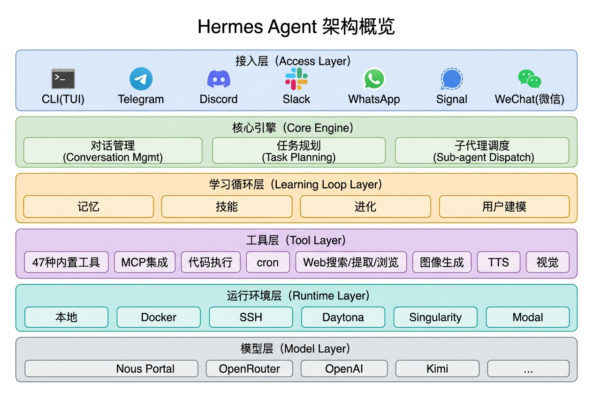

# 认识 Hermes Agent：一个会自我进化的 AI 代理

> 大部分 AI Agent 是无状态的——每次对话从零开始，做完就忘。Hermes Agent 不一样：它有内置的学习循环，能从经验中创建技能、跨会话保留记忆、在使用过程中自我改进。这不是概念，是已经跑通的工程实现。由 Nous Research 开源，MIT 协议，GitHub Star 数超 50k（截至 2026 年 4 月），最新版本 v0.8.0（2026 年 4 月 8 日发布）。

---

## 先给判断

赶时间的读者记这几句：

- **Hermes Agent 的核心差异是学习循环。** 不是"更聪明的 Agent"，而是"用着用着会变强的 Agent"——它从任务中提炼技能、改进技能、记住上下文，跨会话持续积累。
- **模型无关。** 不绑定某个 LLM，支持 Nous Portal、OpenRouter（200+ 模型）、OpenAI、Kimi 等，切换模型一条命令搞定。
- **轻量部署。** 5 美元的 VPS 就能跑，支持 Linux、macOS、WSL2、Android（Termux），不需要 GPU。
- **全平台接入。** CLI、Telegram、Discord、Slack、WhatsApp、Signal，选常用的入口即可。

---

## Hermes Agent 是什么

Hermes Agent 是 Nous Research 构建的自我改进型 AI 代理。"自我改进"不是营销词——它指的是一套具体的工程机制：Agent 在完成复杂任务后，会自主将解决方案抽象为可复用的技能（Skill）；下次遇到类似任务时，直接调用已有技能；如果技能效果不好，还会自动改进。这个"做 → 学 → 用 → 改"的闭环，就是它所说的**封闭学习循环**。

和市面上大多数 Agent 框架对比，区别在哪？

大多数 Agent 的能力边界在部署那一刻就定死了——部署时给它什么工具、什么 prompt，它就只能做什么。Hermes Agent 的能力边界是动态的：用得越多，能做的事越多。它不只是执行任务，还会从任务中学习。

这不是理论设计，是已经落地的产品。项目主语言为 Python，MIT 协议开源，GitHub 地址：https://github.com/nousresearch/hermes-agent。

---

## 核心能力拆解

Hermes Agent 的能力可以拆成六个模块。

### 1. TUI 终端界面

**是什么：** 一个功能完整的终端交互界面，支持多行编辑、斜杠命令自动补全、对话历史浏览、执行中断和任务切换、流式工具输出。

**为什么重要：** Agent 不是一次性跑个脚本就完了——使用过程中需要持续交互、调试、纠偏。一个好用的 TUI 决定了日常使用的流畅度。Hermes Agent 的 TUI 不是简陋的 readline 包装，而是接近 IDE 终端的体验。

### 2. 封闭学习循环

这是 Hermes Agent 最核心的差异化能力，包含五个子机制：

| 子机制 | 说明 |
|--------|------|
| **记忆** | Agent 主动管理的记忆系统，定期提示关键信息，不是被动的向量检索 |
| **技能创造** | 完成复杂任务后，自主将解决方案抽象为可复用技能 |
| **自我进化** | 技能在实际使用中持续自我改进，不是创建后就固定不变 |
| **跨会话检索** | 基于 SQLite FTS5 全文检索的会话搜索 + LLM 摘要，能搜索过去的对话 |
| **用户建模** | 基于 Honcho 的辩证用户建模（通过多轮对立假设逐步构建用户画像），兼容 agentskills.io 开放标准（一套跨 Agent 平台的技能格式规范） |

**为什么重要：** 这套机制解决的是 Agent 的"一次性问题"。没有学习循环的 Agent，本质上是个高级工具——用完即弃，不会成长。有了学习循环，Agent 会随着使用变成一个越用越能干的长期协作者。

### 3. 内置自动化

**是什么：** 内置 cron 调度器，支持用自然语言定义定时任务——写日报、备份数据、定期审计，都可以让 Agent 无人值守执行。

**为什么重要：** Agent 不应该只在收到消息时才干活。内置自动化让 Hermes Agent 从"问答工具"变成"持续运行的助手"。比如让它每天早上汇总昨天的 GitHub 动态，或者每周生成一份项目健康报告。

### 4. 委托与并行

**是什么：** 可以生成隔离的子代理（sub-agent）来处理并行工作流。子代理之间通过 RPC 协议调用工具，外部 Python 脚本也可以通过同一接口与 Agent 交互。

**为什么重要：** 复杂任务往往不是线性的。需要同时查资料、跑代码、整理文档时，单线程执行太慢。子代理机制让 Hermes Agent 能把任务拆开并行处理，而且子代理之间是隔离的，互不干扰。

### 5. 随处运行

**是什么：** 支持六种终端后端——本地、Docker、SSH、Daytona、Singularity、Modal。其中 Daytona 和 Modal 提供无服务器持久性。

**为什么重要：** 不同场景对运行环境的要求不一样。本地开发用本地后端；团队共享用 Docker 或 SSH；需要持久化和弹性伸缩用 Daytona 或 Modal。六种后端覆盖了从个人笔记本到生产集群的完整光谱。

### 6. 研究就绪

**是什么：** 支持批量轨迹生成、基于 Tinker-Atropos 的 RL 训练管道、轨迹压缩。

**为什么重要：** 这是给 AI 研究者准备的能力。对于做 Agent 行为分析、强化学习训练数据收集、或者需要对 Agent 的决策路径做系统性评估的团队，这些工具能省大量时间。普通用户可以跳过这一模块。

---

## 快速上手：3 步跑起来
[text](.)
### 第 1 步：安装

一行命令搞定：

```bash
curl -fsSL https://raw.githubusercontent.com/NousResearch/hermes-agent/main/scripts/install.sh | bash
```

支持平台：Linux、macOS、WSL2、Android（Termux）。**不支持原生 Windows**。

### 第 2 步：配置模型

安装完成后，运行设置向导：

```bash
hermes setup
```

或者直接选择模型：

```bash
hermes model
```

这一步会引导选择 LLM 提供商和具体模型。支持 Nous Portal、OpenRouter（200+ 模型）、智谱 z.ai（GLM 系列）、Kimi/Moonshot、MiniMax、OpenAI 等。选哪个取决于实际需求和预算——免费试用可以选 OpenRouter 上的免费模型，追求效果可以选 Claude 或 GPT 系列。

### 第 3 步：开始对话

```bash
hermes
```

直接启动交互式 CLI，开始和 Agent 对话。第一次对话时，Hermes Agent 会初始化记忆系统和技能库。随着使用积累，它会逐步学习偏好和常用任务模式。

---

## 常用命令速查

| 命令 | 功能 |
|------|------|
| `hermes` | 启动交互式 CLI |
| `hermes model` | 选择 LLM 提供商和模型 |
| `hermes tools` | 配置工具（内置 47 种 + MCP 集成） |
| `hermes setup` | 完整设置向导 |
| `hermes gateway` | 启动消息网关（接入 Telegram/Discord 等） |
| `hermes update` | 更新到最新版本 |
| `hermes doctor` | 诊断问题 |

---

## 架构概览

用层次图展示 Hermes Agent 的核心组件关系：



<details>
<summary>文本版架构图（无法显示图片时展开）</summary>

```
┌─────────────────────────────────────────────────┐
│                   接入层                         │
│  CLI(TUI)  Telegram  Discord  Slack  WhatsApp   │
│                    Signal                        │
├─────────────────────────────────────────────────┤
│                   核心引擎                       │
│  ┌───────────┐  ┌───────────┐  ┌─────────────┐ │
│  │  对话管理  │  │  任务规划  │  │  子代理调度  │ │
│  └───────────┘  └───────────┘  └─────────────┘ │
├─────────────────────────────────────────────────┤
│                  学习循环层                      │
│  ┌────────┐ ┌────────┐ ┌────────┐ ┌──────────┐ │
│  │  记忆  │ │  技能  │ │  进化  │ │ 用户建模 │  │
│  └────────┘ └────────┘ └────────┘ └──────────┘ │
├─────────────────────────────────────────────────┤
│                   工具层                         │
│  47 种内置工具 │ MCP 集成 │ 代码执行 │ cron    │
│  Web 搜索/提取/浏览 │ 图像生成 │ TTS │ 视觉    │
├─────────────────────────────────────────────────┤
│                   运行环境层                     │
│  本地 │ Docker │ SSH │ Daytona │ Singularity   │
│                    Modal                         │
├─────────────────────────────────────────────────┤
│                   模型层                         │
│  Nous Portal │ OpenRouter │ OpenAI │ Kimi │ ... │
└─────────────────────────────────────────────────┘
```

</details>

**模型层在最底部，可以随时替换，不影响上层任何功能。** 学习循环层是核心——记忆、技能、进化、用户建模构成完整的自我改进闭环。

---

## 适用场景与边界

### 适合用 Hermes Agent 的场景

**长期个人助手。** 需要一个越用越顺手的 AI 助手——能记住偏好、积累工作场景专属技能、跨会话保持连贯性——Hermes Agent 的学习循环能力在这个场景下优势最大。

**自动化运维和定时任务。** 内置 cron 调度 + 自然语言定义 + 无人值守执行，适合日报生成、数据备份、定期检查等轻量自动化场景。

**多平台统一入口。** 一个 Agent 同时接入 Telegram、Discord、Slack、微信等七个平台，统一管理，不用为每个平台单独部署。

**AI 研究和 Agent 行为分析。** 批量轨迹生成、RL 环境、轨迹压缩——做 Agent 研究的团队可以直接用这些基础设施。

**低成本部署。** 5 美元 VPS 就能跑，不需要 GPU，适合个人开发者和小团队。

### 不太适合的场景

**企业级生产系统。** Hermes Agent 目前处于 v0.8.0，还没到 1.0。用在生产环境需要评估稳定性风险。

**纯代码开发场景。** 如果核心需求是代码补全、重构、调试，专门的代码 Agent（如 Claude Code、Cursor）在这个垂直领域更深。Hermes Agent 是通用代理，代码只是它的能力之一。

**对延迟敏感的实时场景。** 学习循环、记忆检索、用户建模会带来额外的推理开销。对实时性要求极高的场景需要评估这部分延迟是否可接受。

---

## 与其他方案的简要对比

| 维度 | Hermes Agent | OpenClaw | Claude Code | 普通 ChatGPT |
|------|-------------|----------|-------------|--------------|
| **核心定位** | 自我进化的通用 Agent | 多渠道个人助手 + 技能生态 | 代码开发专用 Agent | 通用对话助手 |
| **学习循环** | 内置，技能自动创建和改进 | 无内置学习循环，技能需手动编写 | 无内置学习循环 | 无内置学习循环 |
| **跨会话记忆** | 分层记忆（FTS5 检索 + 用户建模 + LLM 摘要） | 平面文件记忆（MEMORY.md + SQLite 检索） | 通过 `CLAUDE.md` 和 memory 工具实现 | 内置记忆功能（Plus 用户） |
| **模型绑定** | 模型无关，支持 200+ 模型 | 模型无关，支持 OpenRouter/OpenAI/Anthropic/Ollama | 绑定 Claude 系列 | 绑定 GPT 系列 |
| **部署方式** | 自托管，6 种运行后端（含 Serverless） | 自托管，本地或 Docker | 本地 CLI | 云端 SaaS |
| **接入平台** | CLI + 7 种消息平台（含微信） | CLI + 20 种以上消息平台 | CLI | Web/API |
| **技能生态** | 较新，兼容 agentskills.io 开放标准 | 成熟，ClawHub 社区 5700+ 技能 | 无独立技能市场 | 无独立技能市场 |
| **技术栈** | Python | TypeScript/Node.js | — | — |
| **开源** | MIT 开源 | MIT 开源 | 部分开源 | 闭源 |
| **最适合** | 长期个人助手、需要自我进化的场景 | 多平台接入、快速复用社区技能 | 代码密集型开发 | 日常问答、轻量任务 |

四者定位不同：Hermes Agent 的核心差异在于**自我进化**——技能从任务中自动生成并持续改进；OpenClaw 胜在**生态广度**——渠道覆盖多、社区技能丰富、开箱即用；Claude Code 在代码领域深耕；ChatGPT 在通用对话上体验成熟。

---

## 常见问题

**Q1：Hermes Agent 需要 GPU 吗？**

不需要。Hermes Agent 本身是一个 Agent 框架，模型推理发生在远端 API（如 OpenRouter、Nous Portal），本地只需要 CPU 和网络连接。5 美元的 VPS 就能跑。

**Q2：学习循环创建的技能存在哪里？换设备后还在吗？**

技能默认存储在本地文件系统中。换设备需要手动迁移技能目录，目前没有内置的云端同步。如果使用 Daytona 或 Modal 等远程后端，技能会保留在远端环境里。

**Q3：Hermes Agent 和 LangChain / AutoGPT 有什么区别？**

LangChain 是 Agent 开发框架，提供链式调用和工具编排的构建模块；AutoGPT 是早期的自主 Agent 项目，侧重任务自动执行。Hermes Agent 的核心差异在于学习循环——它不只是执行任务，还能从任务中学习、创建技能并持续改进，这是前两者没有的内置能力。

**Q4：支持中文吗？**

支持。模型层面取决于所选的 LLM——选用支持中文的模型（如 Kimi、智谱 GLM 系列）即可获得中文交互能力。Agent 框架本身对语言没有限制。

**Q5：v0.8.0 意味着什么？能用在正式项目里吗？**

v0.8.0 说明项目还在快速迭代中，API 和功能可能会有 breaking changes。个人使用和内部工具没问题，但如果用在面向客户的生产系统中，建议做好版本锁定和充分测试。

---

## 结论

Hermes Agent 最值得关注的不是模型数量或工具种类——这些是行业标配。它真正的差异在于**学习循环**：从经验中创建技能，在使用中改进技能，跨会话保持记忆，逐步构建用户模型。这套机制让它从"用完即弃的工具"变成了会持续成长的协作者。

v0.8.0 说明项目还在快速迭代，没到稳定期。但方向是对的——Agent 的下一步竞争力不在推理能力本身，而在于谁学得更快、记得更牢、适应得更好。Hermes Agent 是目前在这条路上走得比较远的开源方案。

想试试的话，一行命令就能装：

```bash
curl -fsSL https://raw.githubusercontent.com/NousResearch/hermes-agent/main/scripts/install.sh | bash
```

---

*本文由本人构思并把控，借助 AI 辅助整理成文，仅代表个人观点，欢迎交流。*
