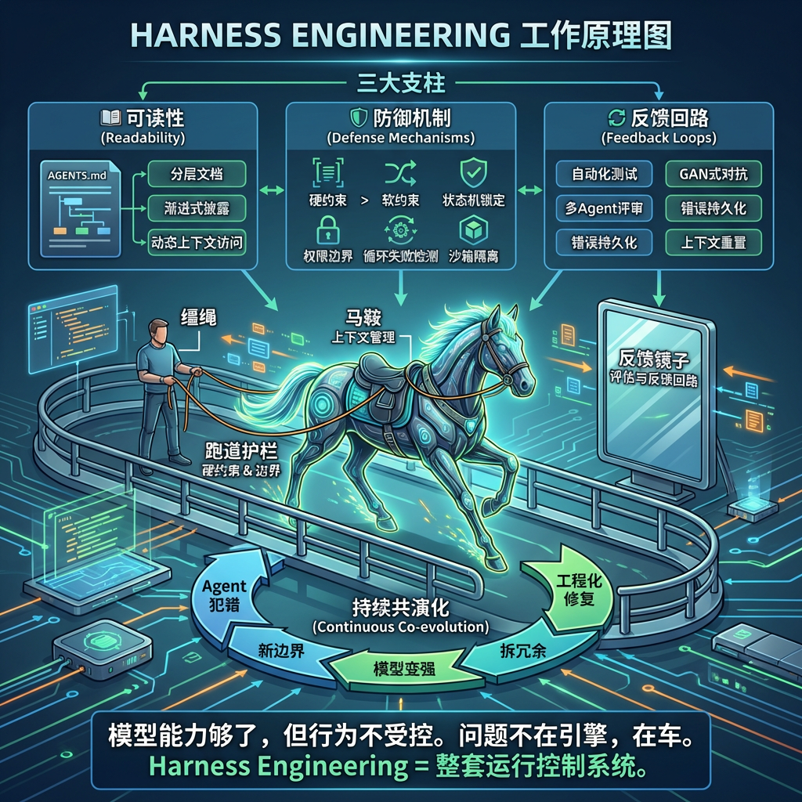

> **Harness Engineering = 给 AI Agent 设计“缰绳 + 马鞍 + 跑道护栏 + 反馈镜子”的工程方法。**
>
> 它不是优化模型本身，而是构建一整套让 Agent **跑得稳、跑得久、不跑偏** 的运行控制系统。



---

## 先说结论

如果只用一句话解释 Harness Engineering：

> **它是在模型之外，给 Agent 搭建一整套“可读、可控、可验证、可恢复”的运行环境。**

它关心的重点不是：

- 模型参数多不多
- Prompt 写得花不花
- 换哪个底座更强

而是：

- Agent 为什么会半路跑偏？
- 为什么会“嘴上说做完了，实际没做”？
- 为什么长任务越跑越乱？
- 为什么接了很多工具以后，系统反而更不稳定？
- 怎么让同样的错误别反复发生？

这就是 Harness Engineering 想解决的问题。

> **说明**：本文主要从 AI coding / agent 工程实践语境讨论 Harness Engineering，强调其工程含义，不追求术语的唯一标准定义。

---

# 一、为什么会需要 Harness Engineering？

## 1.1 一个人人都能秒懂的场景

想象你雇了一个天才实习生：

- 打字极快
- 精力无限
- 什么都懂一点
- 永远不抱怨加班

听起来很美好。  但真实工作里，你很快会发现它有这些毛病：

| 症状 | 具体表现 |
|------|---------|
| **偷懒** | 多步骤任务做到一半，就说“已完成”，其实只做了前几步 |
| **迷失** | 长任务里忘了初始目标，来回试已经失败过的方法 |
| **自我感觉太好** | 让它评估自己写的代码，常常会说“没问题”，哪怕明显有 bug |
| **上下文混乱** | 对话一长、信息一多，就开始草草收尾 |
| **无视规矩** | 团队有明确规范，它仍按自己熟悉的风格乱写 |

这些问题很多时候**不是因为模型不够聪明**，而是因为它缺少一套**外部约束**和**反馈系统**。

在一些长任务开发实验里，研究者就观察到类似现象：  当上下文越来越长、接近窗口上限时，模型往往不是更认真地把任务收尾，而是更容易出现“仓促结束”、“提前停止”这类行为。这个问题本质上不是智商问题，而是**运行环境设计问题**。

---

## 1.2 从“怎么问”到“怎么搭环境”

过去两三年里，AI 工程实践的关注重点，大致经历了一个逐层外扩的过程：

| 阶段 | 核心问题 | 设计对象 | 类比 |
|------|---------|---------|------|
| **Prompt Engineering** | “该怎么问？” | 发给模型的指令文本 | 告诉厨师“中火煎 3 分钟” |
| **Context Engineering** | “该让模型看到什么？” | 模型推理时可见的上下文 | 给厨师备好食材、菜谱和注意事项 |
| **Harness Engineering** | “整个运行环境怎么设计？” | Agent 外部的约束、反馈、验证和执行系统 | 设计整个厨房的动线、安全规范、质检流程 |

可以粗略理解成一种逐层扩展的关系：

- Prompt 是最内层
- Context 更外一层
- Harness 再往外，扩展到整套运行控制环境

也就是说：

> **Prompt 解决“说什么”，Context 解决“给什么”，Harness 解决“整个系统怎么让它稳定做成”。**

---

# 二、Harness Engineering 到底是什么？

## 2.1 更准确的隐喻：马具，不只是接口层

“Harness” 这个词本身就很有意思。  它原本更接近：

- 缰绳
- 马鞍
- 挽具
- 驾驭装置

所以 Harness Engineering 最贴切的隐喻不是“给模型装饰一下”，而是：

> **给一匹力量很大、速度很快、但方向感不稳定的马，配上一整套能驾驭它的东西。**

LLM / Agent 很像这种“烈马”：

- 能力很强
- 自主性更强
- 但并不天然可靠
- 不天然遵守你的项目规则
- 不天然知道什么时候该停、什么时候该验证、什么时候该求助

Harness 的价值，就是让它的能力**真正可驾驭**。一个很有启发性的技术类比是：

> **模型像 CPU，上下文窗口像 RAM，而 Harness 更像围绕 Agent 的运行控制层。**

这个类比不是严格定义，但很好理解：

- 模型负责推理
- 上下文提供工作记忆
- Harness 负责组织流程、约束行为、保存状态、校验结果、处理异常

---

## 2.2 一个更稳妥的定义

如果用工程语言来定义：

> **Harness Engineering 是围绕 AI Agent 构建的一整套约束、上下文管理、反馈回路与执行控制机制，目的是让模型在明确边界内，稳定、可靠、可追踪地完成复杂任务。**

它关心的核心是：

- 怎么组织任务
- 怎么限制行为
- 怎么管理上下文
- 怎么验证结果
- 怎么处理中途失败
- 怎么让同类错误别反复发生

一句更大白话的话就是：

> **Harness 不是让模型更聪明，而是让模型真正能上生产。**

---

## 2.3 它不是什么

这点很重要。Harness 很容易和别的概念混在一起。

| 容易混淆的概念 | 它主要做什么 | 和 Harness 的区别 |
|---|---|---|
| **MLOps** | 模型训练、部署、版本、推理基础设施 | Harness 更关注 Agent 的执行控制 |
| **AI Gateway** | 统一接入、鉴权、限流、路由 | 那是请求入口，Harness 更偏任务运行层 |
| **Prompt Engineering** | 优化单次提问措辞 | Harness 关注整套执行环境 |
| **Agent 框架 / 编排框架** | 提供工具、节点、流程积木 | 框架是工具，Harness 更像方法论 + 工程体系 |

简单说：

> **MLOps 管模型生命周期，平台工程管底座，Harness 管 Agent 在真实任务里怎么被组织、约束、验证和兜底。**

---

# 三、Harness Engineering 的三根支柱

为了便于理解，可以把 Harness 的重点归纳成三类能力：

- **读得懂**
- **管得住**
- **学得会**

也就是：

1. **可读性**
2. **防御机制**
3. **反馈回路**

---

## 支柱一：可读性——让 Agent 读得懂你的系统

Agent 在每次会话开始时，其实对你的项目几乎一无所知。  你不明确告诉它：

- 这个项目是什么技术栈
- 代码目录怎么分
- 哪些规则不能碰
- 改完代码要跑什么命令
- 什么算完成

它就会按自己的“默认世界观”来做事。这就是为什么越来越多团队开始使用类似 `AGENTS.md` 这样的文件。

### 什么是 `AGENTS.md`？

可以把它理解成：

> **给 Agent 看的项目说明书。**

如果 README 是给人看的，  那 `AGENTS.md` 就是专门给 AI Agent 看的。

一个简单例子：

```markdown
# AGENTS.md

## 项目概览
这是一个 Next.js 14 + TypeScript 全栈项目，使用 App Router。

## 技术栈
- 框架：Next.js 14（App Router，不要用 Pages Router）
- 语言：TypeScript（严格模式）
- 样式：Tailwind CSS（不要用 CSS Modules）
- 数据库：Prisma + PostgreSQL
- 测试：Vitest + Testing Library

## 开发命令
- 安装依赖：`pnpm install`
- 开发服务器：`pnpm dev`
- 运行测试：`pnpm test`
- 类型检查：`pnpm typecheck`
- 代码检查：`pnpm lint`

## 代码规范
- 组件使用函数式组件 + Hooks，禁止 Class 组件
- 文件命名：kebab-case
- 不允许 any 类型

## 架构约束
- 所有 API 路由放在 app/api/ 下
- 业务逻辑放在 lib/ 下
- 环境变量通过 env.ts 统一管理，禁止硬编码

## 验证方式
改完代码后必须执行：
1. `pnpm typecheck`
2. `pnpm lint`
3. `pnpm test`
```

### 一个关键点：不是信息越多越好

很多人第一次做这件事，容易犯一个错：  把所有文档、所有规则、所有历史都一股脑塞给模型。实际经验通常刚好相反：

> **全量灌输不如渐进披露。**

更好的做法是：

- `AGENTS.md` 只保留最关键规则
- 详细设计和规范放到 `docs/`
- 让 Agent 按需查阅，而不是一次塞满

如果是 monorepo，也可以分层放：

```text
项目根目录/AGENTS.md
├── packages/
│   ├── web/AGENTS.md
│   └── api/AGENTS.md
```

这样 Agent 在不同子目录下读取到的规则更精准。

---

## 支柱二：防御机制——让 Agent 跑在轨道里，而不是靠自觉

Harness 的一个核心认知是：

> **软约束不够，关键流程必须有硬约束。**

什么叫软约束？

- “请先做计划再执行”
- “请不要跳过测试”
- “请遵守团队规范”

这些写在 Prompt 里有用，但不可靠。  因为模型会忘、会忽略、会在压力下跳过。

什么叫硬约束？

- 没计划就不允许进入下一阶段
- 改了文件必须先跑测试
- 没验证通过就不能宣称完成
- 某些目录根本不允许写入

这类约束一旦写进执行层，Agent 就绕不过去。

但这里有一个很容易被忽略的问题：**"执行层"到底是什么？这些代码跑在哪里？谁来执行它们？**

答案是：**不是 Agent（大模型）自己执行的，也不是你手动在终端里跑的。** 它们跑在一个你自己写的**编排层程序（Orchestrator）**里——你可以理解为"Agent 的管理程序"。

整个调用链条是这样的：

```text
你发起任务 → 编排层程序启动 → 编排层根据状态机决定当前阶段
→ 编排层调用大模型 Agent（只给它当前阶段允许的工具）
→ Agent 返回结果 → 编排层检查结果 → 决定进入下一阶段还是打回重试
```

| 角色 | 是什么 | 做什么 |
|------|--------|--------|
| **编排层（Orchestrator）** | 你自己写的一个 Python 程序 | 管理 Agent 的生命周期：决定当前在哪个阶段、允许调用哪些工具、什么时候切换阶段 |
| **状态机（PhaseStateMachine）** | 编排层里的一个模块 | 记录当前阶段是 RESEARCH / PLAN / EXECUTE / VERIFY，拦截不合法的阶段跳转 |
| **Agent（大模型）** | 被编排层调用的 LLM | 在编排层允许的范围内干活 |

换句话说：**Agent 是被管的那个，状态机是管它的规则，编排层是执行这套规则的程序。**

下面的三个例子，都是写在编排层里的逻辑。

---

### 例子一：状态机锁定执行阶段

复杂任务最好不要一口气跑到底，而是显式分阶段：

- research
- plan
- execute
- verify

先看状态机本身的数据结构——它定义了"哪些阶段跳转是合法的"和"每个阶段允许用哪些工具"：

```python
from enum import Enum

class AgentPhase(Enum):
    RESEARCH = "research"
    PLAN = "plan"
    EXECUTE = "execute"
    VERIFY = "verify"

class PhaseStateMachine:
    ALLOWED_TRANSITIONS = {
        AgentPhase.RESEARCH: [AgentPhase.PLAN],
        AgentPhase.PLAN: [AgentPhase.EXECUTE, AgentPhase.RESEARCH],
        AgentPhase.EXECUTE: [AgentPhase.VERIFY],
        AgentPhase.VERIFY: [AgentPhase.EXECUTE, AgentPhase.PLAN],
    }

    PHASE_PERMISSIONS = {
        AgentPhase.RESEARCH: ["read_file", "search_code", "list_files"],
        AgentPhase.PLAN: ["read_file", "create_plan"],
        AgentPhase.EXECUTE: ["read_file", "write_file", "run_command"],
        AgentPhase.VERIFY: ["run_tests", "run_lint", "run_typecheck"],
    }
```

把这段状态机放到编排层里，实际的调用大概长这样：

```python
# 这是自己写的编排程序，不是 Agent 写的
import openai  # 或其他 LLM SDK

class AgentOrchestrator:
    def __init__(self):
        self.state_machine = PhaseStateMachine()
        self.current_phase = AgentPhase.RESEARCH

    def run_task(self, task_description):
        while self.current_phase != "done":
            # 1. 根据当前阶段，只暴露允许的工具给 Agent
            allowed_tools = self.state_machine.PHASE_PERMISSIONS[self.current_phase]

            # 2. 调用大模型，但只给它当前阶段允许的工具
            response = openai.chat.completions.create(
                model="gpt-4",
                messages=[...],
                tools=self.filter_tools(allowed_tools),  # 关键：只传允许的工具
            )

            # 3. 检查 Agent 的输出，决定是否切换阶段
            next_phase = self.decide_next_phase(response)

            # 4. 状态机检查：这个跳转合不合法？
            if next_phase not in self.state_machine.ALLOWED_TRANSITIONS[self.current_phase]:
                print(f"非法跳转：{self.current_phase} → {next_phase}，拒绝")
                continue

            self.current_phase = next_phase
```

注意第 2 步：编排层调用大模型时，只把当前阶段允许的工具传进去。Agent 不是"被建议不要跳步"，而是**根本拿不到越权的工具**——这就是硬约束和软约束的本质区别。

这样做的好处不是"显得高级"，而是：

- 任务进度清晰
- 可以局部重试
- 可以强制先想后做
- 可以阻止 Agent 一上来就乱改

---

### 例子二：防"嘴上完成，实际上没做"
很多 Agent 最大的问题不是不会做，而是会“提前宣布胜利”。所以需要在执行层检查：

- 你说完成了，有没有真实工具调用记录？
- 你改了代码，有没有跑测试？
- 你说创建成功了，外部系统里真的存在吗？

示意逻辑：

```python
class ToolCallValidator:
    def validate_completion(self, agent_output, tool_call_log):
        if agent_output.claims_done and not tool_call_log.has_calls:
            return ForcedAction(
                action="retry",
                reason="你声称任务已完成，但没有工具调用记录。"
            )

        if tool_call_log.has_file_writes and not tool_call_log.has_test_runs:
            return ForcedAction(
                action="run_tests",
                reason="检测到文件修改但未运行测试。"
            )
```

---

### 例子三：防止反复撞墙

Agent 还很容易出现一个问题：  已经失败两三次了，还在重复同样的动作。这时候就需要循环失败检测：

```python
class LoopDetector:
    def __init__(self, max_retries=3):
        self.failure_log = []
        self.max_retries = max_retries

    def record_failure(self, action: str, error: str):
        self.failure_log.append({"action": action, "error": error})

    def should_break(self, proposed_action: str) -> bool:
        same_failures = [
            f for f in self.failure_log
            if f["action"] == proposed_action
        ]
        return len(same_failures) >= self.max_retries
```

这和传统后端里的熔断器思路很像：

- 连续失败
- 自动打断
- 强制换路径

---

### 例子四：权限边界

只要 Agent 能写文件、调 API、执行命令，就必须有权限边界。

```python
class PermissionBoundary:
    FORBIDDEN_PATHS = [".env", "secrets/", "config/production/", ".git/"]

    def check_file_access(self, file_path: str, operation: str):
        for forbidden in self.FORBIDDEN_PATHS:
            if file_path.startswith(forbidden):
                raise PermissionDeniedError(
                    f"禁止{operation}文件：{file_path}"
                )
```

不要把“别碰生产配置”“别动密钥”这种话只写在提示词里。  真正高风险的地方，要靠代码层拦住。

---

## 支柱三：反馈回路——让 Agent 在犯错后越来越稳

Harness 不是只负责“挡错”，还要负责“吃一堑长一智”。

一个非常关键的经验是：

> **生成和评估最好分开。**

因为 Agent 自己评自己，往往容易“放水”。

---

### 方法一：自动化验证

最基础的一层反馈回路就是：

- 写完代码
- 自动跑 typecheck
- 自动跑 lint
- 自动跑测试
- 不过就打回

示意代码：

```python
class FeedbackLoop:
    def run_verification(self, changed_files: list[str]):
        results = []

        type_result = self.run_command("pnpm typecheck")
        results.append(("typecheck", type_result))

        lint_result = self.run_command("pnpm lint")
        results.append(("lint", lint_result))

        test_result = self.run_command("pnpm test")
        results.append(("test", test_result))

        return VerifyResult(
            passed=all(r.success for _, r in results),
            details=[
                {
                    "check": name,
                    "passed": r.success,
                    "output": r.stdout[-500:],
                    "errors": r.stderr[-500:] if not r.success else None
                }
                for name, r in results
            ]
        )
```

这一步看起来很普通，但它是 Harness 最低成本、最高收益的能力之一。

---

### 方法二：把执行和评审拆开

更进一步，可以让一个 Agent 负责执行，另一个 Agent 负责审查。流程大概像这样：

```text
Agent A：写代码 / 做实现
    ↓
Agent B：按标准评审 / 找问题
    ↓
Agent A：根据反馈修复
    ↓
再次验证
```

示意代码：

```python
async def dual_agent_review(task, executor, reviewer):
    MAX_ROUNDS = 3

    for _ in range(MAX_ROUNDS):
        result = await executor.execute(task)
        review = await reviewer.review(
            task_description=task.description,
            code_diff=result.diff,
            review_criteria=[
                "是否完成所有要求？",
                "是否有 bug？",
                "是否遵循规范？",
                "是否存在安全隐患？",
            ]
        )

        if review.is_good_enough():
            return result

        task = task.with_feedback(review.comments)

    return EscalateToHuman(result, review)
```

它不一定非要上“多智能体架构”那么重， 哪怕只是换一个独立会话来审查，效果通常都比“自己写自己夸”要好。

---

### 方法三：错误经验持久化

Harness 最宝贵的一点是：

> **每一次错误，都应该变成下一次的系统改进。**

比如维护一份经验文件：

```markdown
# .harness/lessons-learned.md

## 2026-03-20: Prisma 迁移必须在测试前执行
- 问题：修改 schema 后没跑 migrate
- 修复：在验证步骤中加入 migrate 检查
- 状态：已纳入硬约束

## 2026-03-18: 不要在 middleware 中直接 throw
- 问题：导致页面白屏
- 修复：补充框架约束说明
- 状态：已写入 AGENTS.md
```

形成一个闭环：

```text
Agent 犯错
→ 分析根因
→ 更新文档 / 约束 / 验证
→ 下次自动带上
→ 同类错误减少
```

这才是 Harness 真正的“工程化”。

---

# 四、怎么从零搭一个最小可用的 Harness？

如果你今天就想开始，不需要一上来搞复杂平台。  先做一个最小可用版本就够了。

---

## 第一步：写一个 `AGENTS.md`

先别追求完美，先把最关键的三类信息写清楚：

- **WHAT**：项目是什么、技术栈是什么
- **HOW**：常用命令、开发流程、验证方式
- **RULES**：哪些规范必须遵守、哪些目录禁止改

这是让 Agent“读得懂系统”的第一步。

---

## 第二步：加一条硬约束

比如最简单也最值回票价的一条：

> **只要改了业务代码，就必须跑测试。**

如果你自己写 Agent 运行层，可以这么做：

```python
def post_edit_guard(agent, edited_files):
    src_files = [f for f in edited_files if f.startswith("src/")]
    if not src_files:
        return

    result = agent.execute("pnpm test --run")
    if not result.success:
        agent.feedback(f"测试失败：\n{result.stderr}\n请修复后重新运行。")
        return RetrySignal()
```

这一条就能消灭很多“我已经做完了但其实没验证”的问题。

---

## 第三步：引入反馈回路

最小版本就是：

```text
Agent 写代码
→ 自动 lint + test
→ 失败则反馈
→ Agent 修复
→ 再验证
→ 直到通过或升级人工
```

很多团队光做到这一步，稳定性就会明显提升。

---

## 第四步：处理长任务的上下文问题

长任务里，一个常见坑是：

- 会话越来越长
- 上下文越来越脏
- 模型越来越不愿意认真收尾

这时与其无限压缩上下文，不如考虑**结构化交接 + 新会话继续**。示意代码：

```python
class ContextManager:
    MAX_CONTEXT_UTILIZATION = 0.6

    async def run_with_reset(self, agent, task):
        subtasks = self.decompose_task(task)

        for subtask in subtasks:
            if agent.context_utilization > self.MAX_CONTEXT_UTILIZATION:
                handoff_doc = await agent.generate_handoff(
                    prompt="总结：1.已完成 2.当前进度 3.下一步 4.注意事项"
                )
                agent = agent.fresh_session()
                agent.load_context(handoff_doc)

            await agent.execute(subtask)
```

核心思路是：

> **不要让一个会话死扛到底，而是让任务可交接、可重置、可续跑。**

---

## 第五步：形成持续改进飞轮

当 Agent 出错时，不要只骂模型不行。  
更有价值的问题是：

- 是不是缺信息？
- 是不是缺约束？
- 是不是缺验证？
- 是不是缺回退机制？

然后把它变成系统改进：

```text
Agent 犯错
→ 归因
→ 补文档 / 补约束 / 补验证 / 补权限
→ 记录经验
→ 下次同类问题更少
```

这就是 Harness Engineering 最核心的工作方式。

---

# 五、一个完整执行时序长什么样？

假设 Agent 收到一个任务：

> “修复 `src/login.tsx` 中的登录 bug”

整个过程可能像这样：

```text
1. Harness 启动新会话，加载 AGENTS.md，初始化状态为 RESEARCH
2. Agent 请求读取 login.tsx
3. Harness 检查：RESEARCH 阶段允许 read_file，放行
4. Agent 想直接改代码
5. Harness 检查：RESEARCH 阶段不允许 write_file，拒绝
6. Agent 转而请求进入 PLAN 阶段
7. Harness 校验状态迁移合法，允许进入 PLAN
8. Agent 生成修复计划
9. Harness 允许 create_plan
10. Agent 请求进入 EXECUTE
11. Harness 允许状态迁移
12. Agent 修改 login.tsx
13. Harness 记录到文件修改事件
14. Harness 自动触发验证守卫
15. Harness 强制进入 VERIFY，运行 typecheck / lint / test
16. 若全部通过，则任务完成；否则把错误反馈给 Agent 重试
```

这里会看到一个很关键的分工：

- **Agent 负责推理和执行**
- **Harness 负责约束和裁判**

Agent 不一定知道状态机代码长什么样，  但它会真实感受到：哪些动作被允许，哪些动作会被拦下，什么才算完成。

---

# 六、真实工程实践给了我们什么启发？

关于 Harness Engineering，最近一批公开分享有一个共同结论：

> **很多时候，Agent 的瓶颈不只在模型能力，更在运行环境设计。**

从这些实践里，至少能提炼出几条一致经验：

---

## 1）项目说明必须对 Agent 友好

如果项目结构复杂、规范隐含、命令分散、禁区不明确，  Agent 很容易走错路。所以“让项目可被 Agent 读取”本身就是第一层工程能力。

---

## 2）关键流程必须靠硬约束，不要只靠提示词提醒

尤其是这些事：

- 改代码后必须验证
- 高风险目录禁止写
- 任务必须分阶段
- 不能跳过测试直接宣布完成

只写在 Prompt 里，远远不够。

---

## 3）验证层越扎实，Agent 越能被放心放权

Agent 真正能承担更多执行工作，不是因为“它看起来很聪明”， 而是因为外面有足够厚的验证层：

- 类型检查
- 测试
- Lint
- 安全扫描
- 代码评审
- 人工兜底

这和传统工程里“自动化程度越高，越需要可靠门禁”是一个道理。

---

## 4）同一个模型，在不同 Harness 下表现差异会很大

这是很多团队越来越清楚感受到的一点：

> **底层模型一样，Harness 不一样，最终产出质量可能差很多。**

也就是说，Harness 不是“附属包装”，而是会直接影响 Agent 的可用性、稳定性和上限。

---

## 5）Harness 不是一劳永逸，而是跟模型一起演化

模型变强后，有些外层补丁会变得多余； 但新的能力边界出现后，又会催生新的约束和验证需求。所以 Harness 不是“搭完收工”，而是一个持续迭代的系统：

```text
模型变强
→ 某些旧约束变冗余
→ 拆掉不必要的部分
→ 暴露新的问题边界
→ 新增新的 Harness 机制
→ 继续演化
```

这很像一套随着 Agent 能力变化而不断重构的“运行控制层”。

---

# 七、给后端工程师的对标翻译

如果你是后端 / Go / 平台工程背景，可以这样理解：

| Harness 概念 | 后端里更像什么 |
|---|---|
| `AGENTS.md` | README + 开发规范 + contributor guide |
| 状态机约束 | 工作流引擎 / Saga / Temporal |
| 权限边界 | RBAC + 沙箱 + ACL |
| 工具调用验证 | 中间件 / AOP / 网关后置校验 |
| 自动验证回路 | CI/CD + 质量门禁 |
| 多 Agent 评审 | Code Review / 审批流 |
| 上下文重置 | 无状态服务 + 会话持久化 |
| 循环失败检测 | 熔断器 / 重试策略 |
| Harness 整体 | 面向 Agent 的执行控制系统 |

所以对后端工程师来说，Harness 不是一个玄学词。它更像：

> **工作流引擎 + 状态机 + 工具沙箱 + 验证器 + 补偿机制 + 可观测执行框架**

只不过这里被管理的“执行者”，不再是固定代码，而是 LLM / Agent。

---

# 八、今天就能开始做的 5 件事

不用等平台团队，不用等架构升级，今天就能做。

| 序号 | 行动 | 耗时 | 效果 |
|------|------|------|------|
| 1 | 写一个最小版 `AGENTS.md` | 10 分钟 | Agent 不再总按默认习惯乱来 |
| 2 | 加一条硬约束：改完代码必须跑测试 | 30 分钟 | 大幅减少“宣称完成但没验证” |
| 3 | 把执行和评审拆开 | 每次多 5 分钟 | 更容易发现自我评估遗漏的问题 |
| 4 | 记录 Agent 的典型错误 | 持续 | 同类问题不必一错再错 |
| 5 | 让人审计划，不是盯每一行代码 | 改变协作方式 | 更接近高效的人机分工 |

---

# 九、一句话收束：Harness 的本质到底是什么？

Harness Engineering 最值得记住的一点是：

> **模型已经足够强了，接下来的竞争，越来越多是在“谁更会设计它的运行环境”。**

前几年我们在研究：

- 怎么和模型说话
- 怎么给模型更多上下文

而现在，越来越多团队开始研究：

- 怎么让模型在工程系统里稳定跑起来
- 怎么让它别跑偏
- 怎么让它犯过的错别再犯
- 怎么让它从“能演示”变成“能交付”

所以如果非要用一句最短的话来定义它：

> **Harness Engineering，不是让模型更聪明，而是让模型真正可驾驭、可上线、可交付。**

---

# 参考阅读

> 下面列的是本文写作时参考过的公开讨论方向。由于相关概念仍在快速演化，建议优先阅读各团队的一手原文与官方仓库。

## 一手资料方向
- Mitchell Hashimoto 关于 AI adoption / harness engineering 的博客讨论
- OpenAI 关于 Codex / Agent-first / Harness Engineering 的公开文章
- Anthropic 关于长任务应用开发中的 harness 设计文章
- `AGENTS.md` 相关官方仓库与社区规范

## 二手解读方向
- Martin Fowler / Thoughtworks 相关分析文章
- LangChain 团队关于 agent harness 改进的技术分享
- 中文社区对 Harness Engineering、Context Engineering、AGENTS.md 的工程解读文章
