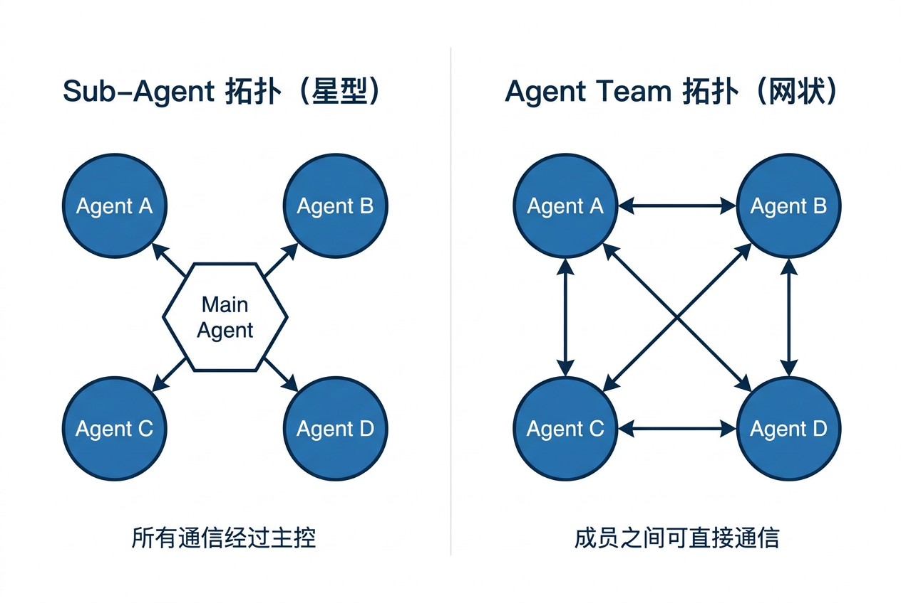
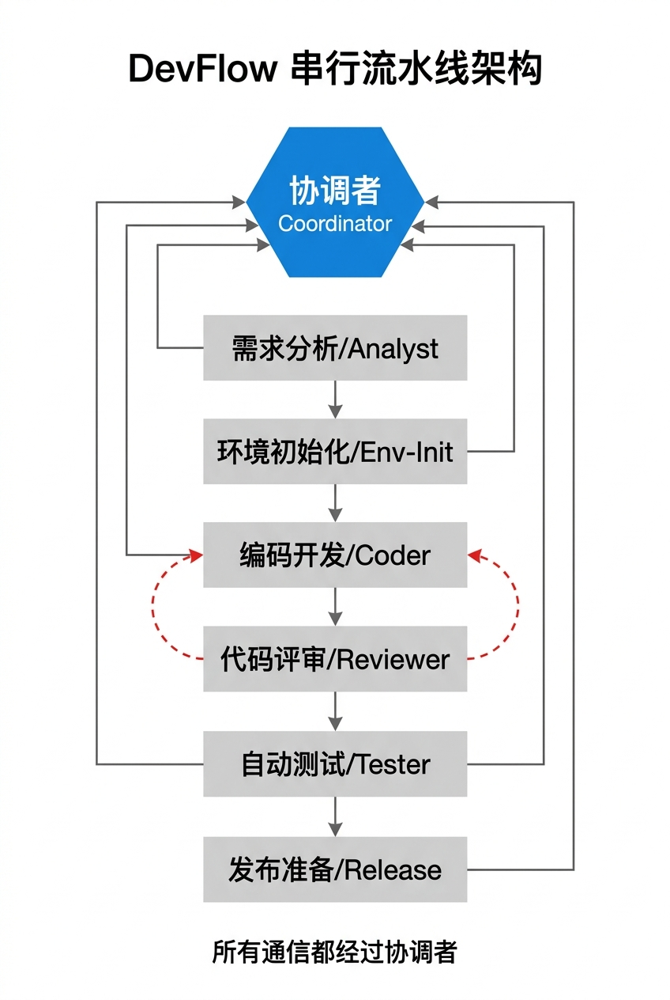
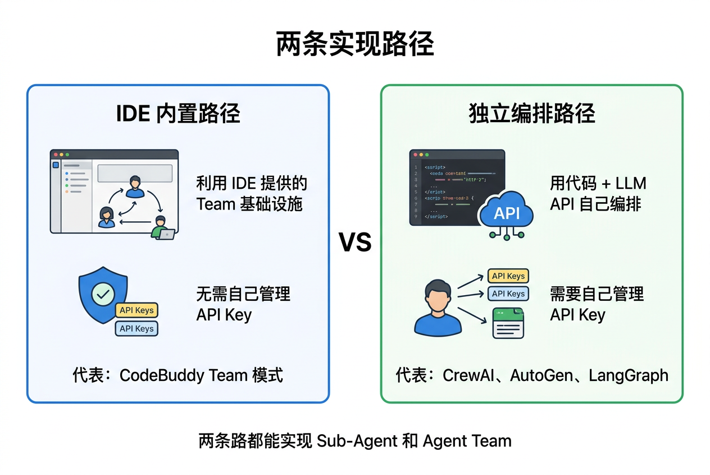
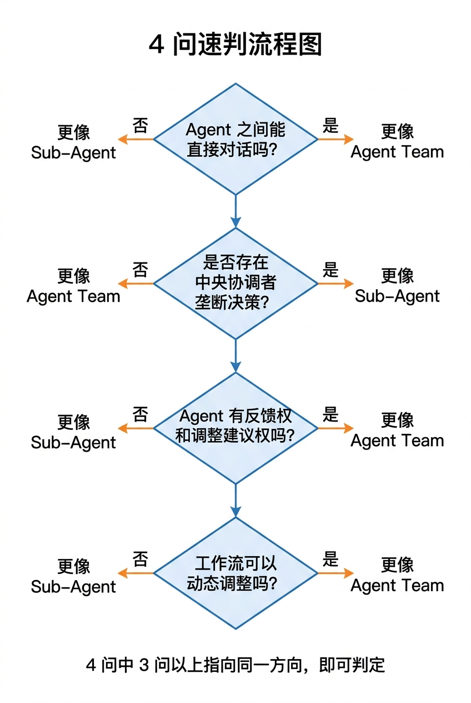

# Sub-Agent 与 Agent Team 的本质区别

> 用了 Team 模式的 API，就是 Agent Team 了吗？从一个真实项目出发，拆解两种多 Agent 架构的核心差异。

---

## 引言：名字叫 Team，就真是 Team 吗？

2026 年，AI 编程圈最热的词之一是"多 Agent 协作"。各种项目纷纷宣称自己是"Agent Team"——听着很酷，多个 Agent 像一个团队一样协作。

但仔细一看代码，很多所谓的"Agent Team"其实是这样的：

```text
老板下指令 → 员工A干活 → 汇报老板 → 老板下指令 → 员工B干活 → 汇报老板 → ...
```

这像团队协作吗？这更像是**老板带着一群只听指令的下属，在流水线上按步骤干活**。

员工之间互不认识、互不交流、干完就走。把这叫"Team"，就像把按需聘用的外包叫"创业合伙人"一样——形式上凑在一起了，本质上可能差得很远。

本文会从一个真实项目出发（为保护原项目隐私，以下用 **DevFlow** 代称），把 Sub-Agent 和 Agent Team 这两种架构模式掰开了讲清楚。同时也聊一个很多人容易混淆的问题：**Agent Team 什么时候需要 API Key，什么时候不需要？这背后的区别到底是什么？**

---

## 第一章：先把概念理清楚

### 1.1 Sub-Agent（子代理）是什么？

一句话：**有一个"老板"Agent，把任务拆成小块，分给"下属"Agent 执行；下属干完向老板汇报，老板再决定下一步。**

关键特征：

- 存在一个明确的**中央协调者**（Orchestrator）
- 子 Agent **主要与协调者通信**，横向通信较弱或不存在——即便存在少量横向消息，整体决策权通常仍集中在中央编排器
- 子 Agent **通常缺乏全局流程主导权**，只在被分配的任务范围内进行局部决策
- 执行顺序通常由协调者**预先定义或主导控制**，子 Agent 很难改变整体流程走向

类比：你是项目经理，手下有 6 个外包。你把需求拆好，一个个分配，每个人干完跟你汇报，你再分配下一个。外包之间可能甚至互不认识。

### 1.2 Agent Team（智能体团队）是什么？

一句话：**多个 Agent 具有不同角色分工、局部目标或评价标准，并具备一定判断力，可以互相对话、协商、甚至争论，共同完成复杂任务。**

关键特征：

- **不等于完全去中心化**——可以有 Team Lead 或协调者，但成员通常拥有一定自治权，协调者不垄断所有关键决策
- Agent 之间**往往存在直接协作或反馈机制**——A 可以找 B 讨论，不一定必须经过中间人
- 每个 Agent 都有一定的**判断能力**，可以反馈风险、要求补充信息、提出替代方案，甚至对流程产生反向影响
- 工作流**可以动态调整**，而不是完全写死的流水线

类比：一个创业团队，CTO、产品经理、设计师各管一摊。产品经理提了一个方案，CTO 说"这个技术上做不了，换个思路"，设计师说"用户体验不对，我建议改成这样"——**大家可以互相影响决策，最终达成共识**。

### 1.3 一张表看清区别

| 维度 | Sub-Agent（子代理） | Agent Team（智能体团队） |
|------|--------------------|-----------------------|
| **控制关系** | 中央协调者主导流程与分工 | 可以有协调者，但不垄断所有关键决策 |
| **Agent 间通信** | 主要与协调者通信，横向通信弱或不存在 | Agent 之间可以直接对话、协商、反馈 |
| **自主性** | 缺乏全局流程主导权，主要完成被分配的子任务 | 具有一定自治权，可反馈风险、提出替代方案、影响流程走向 |
| **工作流** | 更接近预定义流水线，顺序相对固定 | 动态可调，可根据中间结果变化 |
| **生命周期** | 常为按需调用、任务结束回收 | 更常见持续角色化存在，但两者都可做成短期或长期形态 |
| **拓扑结构** | 星型更常见 | 网状或部分网状更常见 |
| **典型场景** | 固定流程：编码→审查→测试→发布 | 开放问题：方案讨论、架构设计、头脑风暴 |
| **稳定性与成本** | 在流程确定任务中更可控、更稳定、成本更容易收敛 | 在高不确定性任务中可能通过多视角校验取得更好结果，但协调复杂度和成本更高 |

用图说得更直观：



```text
Sub-Agent 拓扑（星型）：          Agent Team 拓扑（网状）：

       ┌───┐                      ┌───┐ ◄──► ┌───┐
       │ A │──┐                   │ A │       │ B │
       └───┘  │                   └───┘ ◄──► └───┘
       ┌───┐  │   ┌──────┐          ▲           ▲
       │ B │──┼──►│ 老板  │          │           │
       └───┘  │   └──────┘          ▼           ▼
       ┌───┐  │                   ┌───┐ ◄──► ┌───┐
       │ C │──┘                   │ C │       │ D │
       └───┘                      └───┘       └───┘

  所有箭头指向老板                  箭头互相连接
  A/B/C 之间几乎无交流              A/B/C/D 可以互相对话
```

> **注**：上图展示的是典型形态。实际工程中常见混合拓扑——中心协调 + 局部点对点协作的组合。

---

## 第二章：拿真实项目来验证——DevFlow 是 Sub-Agent 还是 Agent Team？

**说明**：下文对 DevFlow 的判断，基于其公开 prompt、工作流描述和消息路由规则进行架构分析；如果底层运行时存在未公开的成员间通信、共享状态机制或动态路由能力，则结论可能需要相应调整。



**DevFlow** 是一个基于 CodeBuddy 的多 Agent 工作流项目，作者称之为"多 Agent 协作"。它包含 6 个 Agent：

| Agent | 职责 |
|-------|------|
| `analyst` | 需求分析 |
| `env-init` | 环境初始化 |
| `coder` | 编码开发 |
| `reviewer` | 代码评审 |
| `tester` | 自动测试 |
| `release` | 发布准备 |

看着挺像一个团队。但让我们用上面的标准逐条验证。

### 证据 1：有一个明确的"老板"

`devflow.md` 开头第一句话：

> 你是工作流协调者，负责将任务拆解并编排多个专属子Agent协作完成全流程开发工作。

**"工作流协调者"**——这基本就是老板。至少从公开描述看，所有关键决策都集中在它手里：判断是 Bug 修复还是新需求、决定启动谁、决定何时进入下一步。

### 证据 2：Agent 之间不能直接协作

所有 Agent 的通信规则写得很明确：

```text
每个 Agent 完成任务后，必须使用 send_message 工具向 main（协调者）发送完成通知
```

`recipient` 永远是 `"main"`。`analyst` 不会直接找 `coder` 说"这个需求有个坑你注意一下"；`reviewer` 发现问题也不会直接告诉 `coder`"你这段代码有 Bug"——从公开规则看，一切都经过协调者中转。

### 证据 3：严格串行，流程主导权不在子 Agent 手里

```text
所有 Agent 均使用 Team 模式异步启动，但严格串行推进：
每个 Agent 启动后，协调者等待其通过 send_message 发回完成消息，收到后再启动下一阶段。
```

注意这句话里的关键点：**虽然用了"异步启动"的 API，但整体推进方式是"严格串行"的。** A 完成 → 协调者收到 → 启动 B → B 完成 → 协调者收到 → 启动 C……这本质上仍是一条流水线。

### 证据 4：Agent 缺乏改变整体流程的权限

看每个 Agent 的 prompt，模式几乎一致：

1. 协调者给一个固定 prompt + 追加上下文
2. Agent 按要求执行
3. 执行完 `send_message` 汇报
4. 流程是否继续、回退、切换阶段，由协调者决定

从公开规则看，看不到任何一个 Agent 具备以下能力：
- 主动发起和另一个 Agent 的协商
- 对任务分配提出实质性调整建议并直接改变流程
- 基于自己的判断重新定义后续工作顺序

它们可以做局部决策，但看不到对**全局流程**的主导能力。

### 证据 5：唯一的"反馈循环"也是老板控制的

项目里唯一看起来像"协作"的环节是代码评审的循环：

> 收到评审报告后，读取 code-review.md，检查是否存在 🔴 必须修改项：
> - **存在 🔴 项**：重新启动阶段三（编码开发）
> - **无 🔴 项**：评审通过，进入阶段五

但仔细看，这个循环的决策者是谁？还是**协调者**。`reviewer` 只负责给出报告，`coder` 只负责改代码。"要不要退回"这个决策并不由二者直接协商决定，而是由协调者控制。

如果是更强协作型的 Agent Team，常见形式会是：`reviewer` 直接把问题发给 `coder`，双方围绕缺陷修复进行来回协商，必要时再上升到协调者。

### 验证结论

| 验证维度 | 强协作型 Agent Team 更常见的表现 | DevFlow 实际表现 | 指向 |
|---------|------------------------------|------------------|------|
| 控制关系 | 协调者不垄断关键决策 | 协调者→6 个执行者，整体上严格上下级 | Sub-Agent |
| Agent 间通信 | 存在直接协作或反馈机制 | 只能发消息给 `main` | Sub-Agent |
| 自主性 | 成员可反馈并影响流程 | 主要执行被分配的固定任务 | Sub-Agent |
| 动态协作 | 分工和路径可根据情况调整 | 固定 6 步流水线 | Sub-Agent |
| 生命周期 | 常见持续角色化存在 | 用完 `shutdown` + `team_delete` | 偏 Sub-Agent |
| 拓扑结构 | 网状或部分网状 | 星型 | Sub-Agent |

**整体上，六项都明显指向 Sub-Agent 方向。** 按本文采用的判定标准，DevFlow 更接近一个 **Orchestrator-Driven Sequential Sub-Agent Pipeline**（编排器驱动的串行子代理流水线），而不是强协作型 Agent Team。

### 为什么作者会叫它 "Agent Team"？

因为 CodeBuddy 提供了一个叫 **"Team 模式"** 的 API——`Task` 工具传入 `name` 参数，就是以 "team member" 身份启动。作者用了这个 API，自然容易跟着把整体叫成 "team"。

但 **API 名称 ≠ 架构模式**。就像你用了一个叫 `createThread()` 的函数，不代表你的程序在架构上就是成熟的多线程系统——你可能只是创建了一个线程，然后串行等待它完成。

### 有 agents/ 目录就是 Agent Team 吗？

还有一个更隐蔽的误解：看到一个 Skill 的目录结构是 `commands/` + `agents/`，里面有多个 Agent 定义文件，就觉得"这是一个 Agent Team"。

来对比一下 DevFlow 和一个 Agent Team 风格项目的目录结构：

```text
DevFlow（Sub-Agent）：                  某 Agent Team 项目：

├── commands/devflow.md               ├── commands/team.md
└── agents/                            └── agents/
    ├── analyst.md                         ├── scout.md
    ├── env-init.md                        ├── architect.md
    ├── coder.md                           ├── writer.md
    ├── reviewer.md                        ├── reviewer.md
    ├── tester.md                          └── polisher.md
    └── release.md
```

**几乎一模一样。** 目录结构本身并不能决定它是不是 Agent Team。

真正的区别，在于 `agents/` 里 prompt 如何定义通信规则和决策权：

| 维度 | DevFlow 的 Agent prompt | 更强协作型 Agent Team 的 prompt |
|------|------------------------|------------------------------|
| **send_message 给谁** | 只允许发给 `main` | 允许发给其他成员 |
| **决策权** | "完成后通知协调者" | "根据情况决定是否退回给 writer / coder" |
| **流程** | "按固定步骤执行" | "根据情况决定下一步找谁" |

所以：**`commands/` + `agents/` 是通用脚手架，不是架构结论。** 从 Sub-Agent 升级到 Agent Team，未必需要改目录结构，真正要改的往往是 **prompt 里的通信规则、权限边界和路由逻辑**。

### 有 send_message 就是 Agent Team 吗？

这是另一个常见误解：看到 Agent 调用了 `send_message`，就觉得"它们在互相通信，所以是 Agent Team"。

不对。**`send_message` 只是一个通信工具**，就像电话——关键不是你有没有电话，而是**你被允许打给谁、打了之后谁做决定**。

看看 DevFlow 里 `send_message` 的实际用法：

```text
type: "message"
recipient: "main"
content: "阶段X完成，产物：xxx，状态：成功/失败"
```

每一条 `send_message` 的 `recipient` 都是 `"main"`。没有公开证据显示某个 Agent 会直接给另一个 Agent 发消息。

| 维度 | 强协作型 Agent Team 的 `send_message` | DevFlow 的 `send_message` |
|------|--------------------------------------|--------------------------|
| **发给谁** | 其他 Agent 或协调者 | 只发给 `main`（协调者） |
| **内容是什么** | 讨论、协商、反馈 | 阶段完成通知 |
| **谁决定下一步** | 发消息者和接收者都可能影响流程 | 主要由 `main` 决定 |
| **通信方向** | 双向、多向 | 单向上报 |

打个比方：

- **DevFlow 的 `send_message`** = 员工写周报交给老板。员工之间不互相发周报，老板看完才安排下一个。
- **Agent Team 的 `send_message`** = 团队在群里讨论。reviewer 直接 @ coder 说"第 42 行有空指针风险"，coder 自己判断要不要改、怎么改，不用等老板指示。

所以，**用了 `send_message` ≠ 已经形成 Agent Team**。关键要看 `recipient`、消息内容和决策权分布。

---

## 第三章：Agent Team 和 API Key 是什么关系？

很多人有一个困惑：Agent Team 是不是一定需要 API Key？不需要 API Key 的就不是真正的 Agent Team？

答案是：**不一定。取决于你走哪条实现路径。**



### 3.1 两条实现路径

构建多 Agent 系统，目前主流有两条路：

| 路径 | 说明 | 代表 | 是否需要自己管理模型接入凭证？ |
|------|------|------|---------------------------|
| **IDE 内置路径** | 利用 IDE 提供的 Team 基础设施，在 IDE 内部编排多 Agent | CodeBuddy Team 模式、Cursor Agent 等 | 通常不需要 |
| **独立编排路径** | 用代码 + LLM API 自己编排多 Agent 系统 | CrewAI、AutoGen、LangGraph、自研 Python 脚本 | 通常需要 |

先说清楚：**这两条路都能实现 Sub-Agent，也都能实现 Agent Team。** API Key 的有无，和 Sub-Agent / Agent Team 的架构差异没有必然关系——它主要取决于**谁在帮你管理模型连接和鉴权**。

### 3.2 IDE 内置路径：通常不需要自己提供 API Key

以 CodeBuddy 为例，IDE 内置路径的典型优势是：很多底层能力由 IDE 统一托管，用户不需要自己处理模型接入和鉴权。

从公开能力描述和项目实践看，这类 Team 模式通常具备一些多 Agent 基础设施，例如：角色化运行、消息路由、多成员调度、可能的并行执行能力。

```
┌──────────────────── CodeBuddy IDE ────────────────────┐
│                                                       │
│   ┌─────────┐   message    ┌─────────┐               │
│   │ Agent A │ ◄──────────► │ Agent B │               │
│   │ 角色化运行│              │ 角色化运行│               │
│   └─────────┘              └─────────┘               │
│        ▲                         ▲                    │
│        │        message          │                    │
│        └────────┐   ┌───────────┘                    │
│                 ▼   ▼                                 │
│             ┌─────────┐                               │
│             │ Agent C │                               │
│             │ 角色化运行│                               │
│             └─────────┘                               │
│                                                       │
│   底层 LLM 连接由 IDE 统一管理，用户通常无感            │
└───────────────────────────────────────────────────────┘
```

需要注意的是：

- 从项目使用表现看，team member **至少具备一定程度的上下文隔离与角色分工能力**
- 若 Team 模式允许 `send_message` 指向任意 team member（而非仅 `main`），那么它在通信能力上就**不局限于星型结构**
- 若支持并行调度，那么它也具备实现更复杂协作拓扑的基础

所以在 CodeBuddy 的 Team 模式下，**从能力边界看，它具备实现 Agent Team 的关键基础设施**。但某个具体项目是否真正形成 Agent Team，仍然取决于 prompt 设计、消息能发给谁、谁拥有决策权、工作流是否允许动态调整。

DevFlow 没做成强协作型 Agent Team，不一定是因为工具能力不够，更可能是因为**它的 prompt 设计把通信约束成了"只向 `main` 汇报"**。换句话说：**工具层面可能提供了更丰富协作的空间，但项目自身选择了星型拓扑。**

那如果真想在 CodeBuddy Team 模式里做出 Agent Team，prompt 应该怎么设计？至少需要满足三个条件：

| 条件 | 怎么做 |
|------|--------|
| **Agent 之间直接对话** | prompt 里允许 `send_message` 发给其他 member，而非只发 `main` |
| **自主决策** | prompt 里给 Agent 判断权，比如 reviewer 可以自己决定退不退回给 coder |
| **动态协作** | prompt 里不写死流程顺序，让 Agent 根据情况决定下一步找谁、做什么 |

但现实是：**从笔者观察到的案例来看，大多数基于 CodeBuddy Team 模式的项目，做的都是 Sub-Agent 流水线。** 原因很简单——Sub-Agent 更简单、更可控，对固定流程来说完全够用。在常见、标准化的软件交付流程中，Sub-Agent 往往已经足够；真正需要高密度协商的 Agent Team（如大规模代码迁移、安全审计策略博弈、多仓库依赖升级、架构重构中的 trade-off 分析）在编程工作流里相对少见，但并非没有。

所以 CodeBuddy Team 模式是一把**足够好的锤子**，但它能钉出什么，取决于你怎么设计 prompt。

### 3.3 独立编排路径：通常需要自管模型接入凭证

如果你不依赖 IDE，用 Python + LLM API 自己编排多 Agent 系统，那每个 Agent 需要独立调用 LLM API，这时候就**需要自行管理模型接入凭证**了——最常见的是 API Key，但也可能是企业模型网关、云鉴权令牌（如 Azure/GCP/AWS 的 IAM）或本地推理服务。

```
┌──────────────┐     ┌──────────────┐     ┌──────────────┐
│   Agent A    │ ◄──►│   Agent B    │ ◄──►│   Agent C    │
│              │     │              │     │              │
│ 推理请求/工具 │     │ 推理请求/工具 │     │ 推理请求/工具 │
└──────┬───────┘     └──────┬───────┘     └──────┬───────┘
       │                    │                    │
       ▼                    ▼                    ▼
  ┌─────────────────────────────────────────────────┐
  │       模型服务（OpenAI / Claude / 自建服务等）     │
  │        需要自行管理鉴权、配额与调用路由            │
  └─────────────────────────────────────────────────┘
```

用这条路径的典型框架有：

| 框架 | 说明 |
|------|------|
| **CrewAI** | 定义多个角色，各有目标和工具，可协作 |
| **AutoGen / Microsoft Agent Framework** | 微软出品，AutoGen 已演进为 Microsoft Agent Framework，强调多 Agent 对话与协作 |
| **LangGraph** | 用图结构编排状态、分支和 Agent 流程 |
| **自研脚本** | 直接调 OpenAI / Claude / 本地模型 API |

这些框架的共同点是：**模型访问不再由 IDE 帮你托管，而是由你自己负责。**

### 3.4 为什么独立编排路径通常要自管凭证？

你可能会问：为什么不能像 IDE 一样，一个连接搞定？

因为独立编排路径通常要解决更复杂的问题：

#### 原因 1：多个独立的推理空间

每个 Agent 有自己的 system prompt、自己的对话历史、自己的工具集。它们需要**互不干扰的推理空间**。你不能把 reviewer 的审查上下文和 coder 的编码上下文塞在同一个对话里——会互相污染。

多个独立 Agent 通常意味着多组上下文和更多推理请求。如果这些请求由你自己的编排层直接发往模型服务，就需要你自行管理鉴权与配额。

#### 原因 2：并行执行

Agent Team 里多个 Agent 可以**同时工作**——A 在分析需求的同时，B 可以在准备环境，C 可以在预研技术方案。这需要**并发调用 LLM API**，每次调用都需要有效的鉴权凭证。

#### 原因 3：持久化和跨会话

独立编排的 Agent 可以有**持久记忆**——reviewer 记得它审过的所有代码模式，coder 记得它积累的编码经验。这些记忆需要跨会话保存，下次启动时从 API 重新加载上下文。每次启动 = 新的 API 调用 = 需要有效凭证。

#### 原因 4：灵活性和可扩展性

独立编排路径可以：
- 不同 Agent 用**不同的 LLM**（reviewer 用推理更强的模型，coder 用代码能力更好的模型）
- 部署在**不同的机器**上
- 独立**扩缩容**

这些灵活性的代价就是：你得自己管理模型接入方式。

### 3.5 一张表总结两条路径

| 维度 | IDE 内置路径 | 独立编排路径 |
|------|-------------|-------------|
| **代表** | CodeBuddy Team 模式 | CrewAI / AutoGen / LangGraph |
| **模型接入** | IDE 托管 | 自行管理 |
| **能否实现 Sub-Agent** | ✅ 能 | ✅ 能 |
| **能否实现 Agent Team** | ✅ 能（取决于能力边界和 prompt 设计） | ✅ 能 |
| **多模型支持** | 往往受 IDE 限制 | 通常更灵活 |
| **部署灵活性** | 较低 | 较高 |
| **上手门槛** | 低（写 prompt 为主） | 高（要写代码、管路由、管模型接入） |
| **成本可见性** | 较低（常被 IDE 费用打包） | 较高（可单独统计调用成本） |

### 3.6 所以到底怎么理解 API Key 这件事？

简单说：

> **API Key 不是区分 Sub-Agent 和 Agent Team 的标准。** 它只是区分"谁在帮你管理模型连接"的标准。
>
> - IDE 帮你管 → 你通常不需要自己提供凭证 → Sub-Agent 和 Agent Team 都能做
> - 你自己管 → 你通常需要自行管理模型接入 → Sub-Agent 和 Agent Team 也都能做

但从实践上看，**走独立编排路径的项目，做成 Agent Team 的概率通常更高**。原因很简单：既然都愿意自己承担编排成本了，往往是因为你需要更灵活的拓扑、更复杂的协商机制、多模型混用、更强的扩展性。这些恰好是 Agent Team 常见的需求。

反过来，**在 IDE 里零配置就能跑起来的项目，更容易自然演化成 Sub-Agent 流水线**——因为这种模式简单、稳定、容易调试，而且对大量固定流程任务来说已经足够好用了。

---

## 第四章：Sub-Agent 不好吗？

说到这里，你可能觉得我在贬低 Sub-Agent。完全不是。

**Sub-Agent 在很多场景下反而比 Agent Team 更好。** 对于"需求→编码→审查→测试→发布"这种**流程确定、步骤固定、验收标准清晰**的任务，Sub-Agent 流水线通常就是更优解：

| 优势 | 说明 |
|------|------|
| **可靠性高** | 对于流程确定的任务，更不容易跑偏 |
| **可控性强** | 每一步都在协调者掌控之中 |
| **成本更容易收敛** | 编排简单、消息链路短、上下文扩散较少 |
| **调试容易** | 串行流水线，出了问题更容易逐步定位 |
| **配置成本低** | 在 IDE 里往往开箱即用 |

DevFlow 用 Sub-Agent 来做"需求→环境→编码→审查→测试→发布"，从工程角度看其实是**非常合理的选择**。这种固定流程，本来就不一定需要 Agent 之间反复协商。

真正更适合 Agent Team 的场景，往往是下面这些：

| 场景 | 为什么更需要 Agent Team |
|------|------------------------|
| **方案讨论** | 多个角度的观点需要碰撞、协商、达成共识 |
| **架构设计** | 不同技术栈的专家需要互相质疑和挑战 |
| **复杂调研** | 多个方向需要同时探索，发现后互相分享 |
| **创意工作** | 需要头脑风暴、灵感碰撞、意外发现 |
| **动态任务** | 需求和约束会在执行过程中变化 |
| **大规模工程协作** | 代码迁移、安全审计策略博弈、多仓库依赖升级、架构重构的 trade-off 分析 |

**不是所有多 Agent 场景都需要 Agent Team，也不是所有 Sub-Agent 都应该升级为 Agent Team。** 选对架构，比起个酷名字重要得多。

---

## 第五章：如何判断一个项目到底是 Sub-Agent 还是 Agent Team？



给你一个快速判断清单，4 个问题问完，基本就能下结论：

| # | 问题 | 如果"是" | 如果"否" |
|---|------|----------|----------|
| 1 | Agent 之间能直接对话吗？ | → 更像 Agent Team | → 更像 Sub-Agent |
| 2 | 是否存在一个中央协调者垄断大多数关键决策？ | → 更像 Sub-Agent | → 更像 Agent Team |
| 3 | Agent 对任务执行方式有反馈权和调整建议权吗？ | → 更像 Agent Team | → 更像 Sub-Agent |
| 4 | 工作流可以根据中间结果动态调整吗？ | → 更像 Agent Team | → 更像 Sub-Agent |

4 个问题里如果有 3 个以上指向同一方向，通常就能做出比较稳的判断。

> **注意**：以前有人把"需不需要 API Key"也列为判断标准，这是不准确的。API Key 的有无取决于实现路径（IDE 内置 vs 独立编排），与 Sub-Agent / Agent Team 的架构区分没有必然关系。详见第三章。

拿 DevFlow 来跑一遍：

| # | 问题 | 答案 | 指向 |
|---|------|------|------|
| 1 | Agent 之间能直接对话吗？ | 否，只能发消息给 `main` | Sub-Agent |
| 2 | 是否存在一个中央协调者垄断大多数关键决策？ | 是，`devflow.md` 就是协调者 | Sub-Agent |
| 3 | Agent 对任务执行方式有反馈权和调整建议权吗？ | 从公开规则看，基本没有 | Sub-Agent |
| 4 | 工作流可以动态调整吗？ | 否，整体是固定 6 步流水线 | Sub-Agent |

4/4 全部指向 Sub-Agent。所以，至少按本文的分析框架，结论是明确的。

---

## 结论

### 核心观点

1. **名字不等于本质**：用了 "Team 模式" 的 API，不代表架构上就是 Agent Team。就像用了 `createThread()`，不代表系统设计上就是成熟的并发架构。

2. **Sub-Agent 和 Agent Team 是两种不同的协作模式**：前者更像"协调者主导的星型流水线"，后者更像"具有自治和反馈能力的协作网络"。

3. **API Key 是实现路径问题，不是架构模式问题**：IDE 内置路径通常不需要你自己提供凭证，但照样可以做 Agent Team；独立编排路径通常需要你自管模型接入，但也可能只是 Sub-Agent。

4. **没有绝对优劣，只有是否适配任务**：流程确定、验收标准清晰的任务用 Sub-Agent 更可控、更便宜、更好调试；高不确定性、需要多视角碰撞的任务用 Agent Team 更灵活，但协调复杂度和成本也更高。

5. **从公开能力和项目实践看，CodeBuddy Team 模式具备多 Agent 协作所需的一些关键基础设施**：例如角色化运行、消息路由和调度能力。至于是否支持任意成员间直连消息、上下文隔离的具体边界，以及能否稳定支撑真正的网状协作，仍建议以官方文档和实际版本行为为准。这也意味着：某个项目最终表现为 Sub-Agent 还是 Agent Team，往往不只是工具决定的，更是 **prompt 设计、权限分配和消息路由策略** 决定的。

### 写在最后

AI 圈从来不缺新概念，缺的是把概念理清楚的人。下次有人跟你说"我做了一个 Agent Team"，别先看名字，也别先看 API。先问四个问题：

- Agent 能不能直接对话？
- 决策权是不是被一个协调者垄断？
- 成员有没有反馈权和调整建议权？
- 工作流能不能动态变化？

答完这四个问题，你通常就知道：这到底是真的 Team，还是一个老板带着一群听话执行器的流水线。

---

*本文由 AI 原生生成，内容经本人构思并把控，仅代表个人观点，欢迎交流探讨。*
