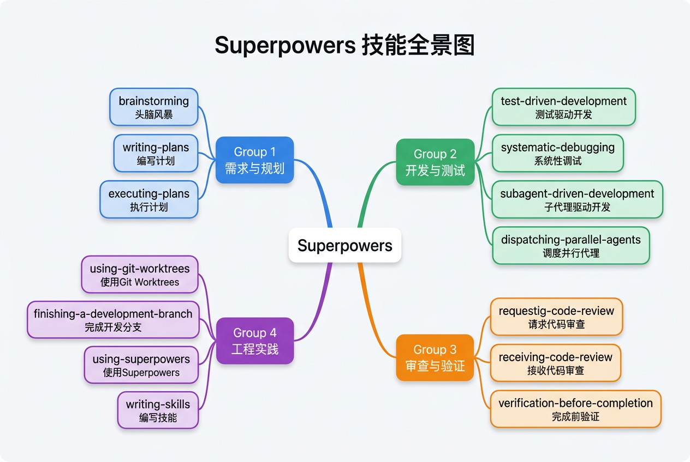
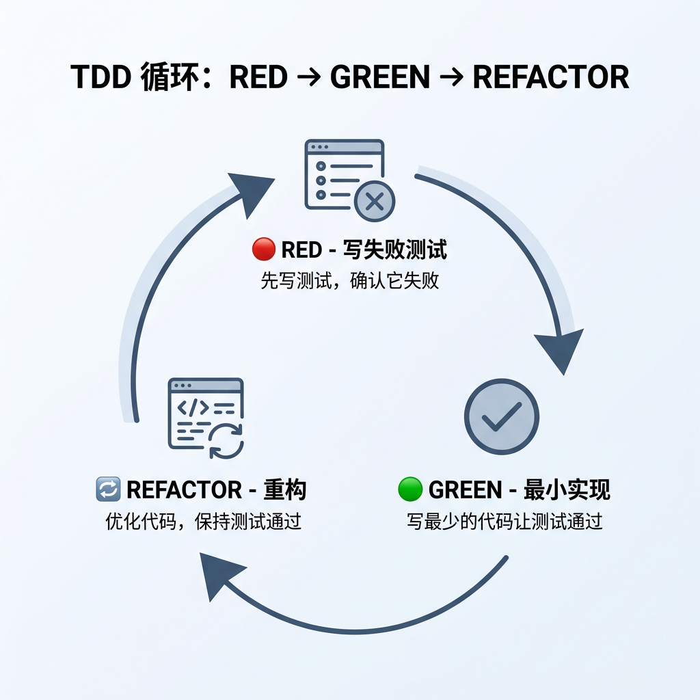

# Superpowers 是什么？一套把 AI 写代码从“能跑”拉到“靠谱”的工作流

> 给已经在用 AI 写代码、但越来越受不了“先写再说”的开发者：这篇只回答三件事——它是什么、什么时候值得用，以及你能不能把它那套纪律搬到 CodeBuddy 里。

让 AI 写代码，它最常见的问题不是“不聪明”，而是“太着急”。需求没问清就开写，测试没补就交差，Bug 没定位就乱改。最后当然也许能跑，但你不太敢接着维护。

**Superpowers** 就是来管这件事的。它不是给模型“加智商”，而是给 AI 编程助手**加纪律**。

这个项目由 Jesse Vincent（`obra`）发起，项目地址在 [GitHub 仓库](https://github.com/obra/superpowers)。按 2026 年 4 月 GitHub 页面显示，仓库已经到 **13.5 万 Star**。README 里列出的官方支持工具包括 Claude Code、Cursor、Codex、OpenCode、GitHub Copilot CLI 和 Gemini CLI；**官方列表里没有 CodeBuddy**。不过别急，这不等于你用不了它的思路。后面我会讲怎么借过来。

## 先一句话说清：Superpowers 不是单个 Skill

如果你只记一句，就记这个：

> **Superpowers 不是一个 Skill，而是一组围绕软件开发流程组织起来的 skill 集合，加上一套工程化工作方法。**

把几个容易混的词拆开看，会更清楚：

| 概念 | 它是什么 | 你怎么理解 |
|------|----------|------------|
| **Superpowers** | 一组可组合的 skill 集合 + 工作方法 | 一台“给 AI 立规矩”的整车 |
| **单个 skill** | 某一项具体能力 | 一个零件，比如澄清需求、做 TDD、审代码 |
| **方法论** | 这些 skill 背后的做事顺序和纪律 | 先想清楚，再动手，写完还得验 |

更准确一点说，Superpowers 的价值不在“它有个壳子”，而在**它把 AI 开发里最容易省掉的环节，全都提到了台面上**。

## 它到底在管什么

Superpowers 最有意思的地方，不是 skill 多，而是它们不是乱堆的。它们基本围着一条完整开发链路在排兵布阵。



### 按开发阶段看，会更容易懂

| 阶段 | 代表 skill | 主要作用 |
|------|------------|----------|
| **需求澄清** | `brainstorming` | 先把问题问明白，别上来就写 |
| **计划拆解** | `writing-plans`、`executing-plans` | 把大任务拆成小步，降低跑偏概率 |
| **实现与调试** | `test-driven-development`、`systematic-debugging` | 用 TDD 和系统化调试逼 AI 老实一点 |
| **并行协作** | `subagent-driven-development`、`dispatching-parallel-agents` | 让多个代理分工，但不是一窝蜂乱跑 |
| **审查与收尾** | `requesting-code-review`、`receiving-code-review`、`verification-before-completion`、`finishing-a-development-branch` | 写完先验、先审，再谈完成 |
| **辅助能力** | `using-git-worktrees`、`using-superpowers`、`writing-skills` | 管隔离开发、使用说明和自定义扩展 |

截至 2026 年 4 月，仓库 `skills` 目录里**可见 14 个核心 skill**。数量当然重要，但更重要的是它们背后那条主线：

**先澄清需求 → 再拆解计划 → 再实现与调试 → 最后验证与审查**

这才是 Superpowers 真正想卖给你的东西。

## 它解决的不是“写不出代码”，而是“写出来不靠谱”

很多人第一次听到 Superpowers，会误会成“又一个让 AI 更强的插件”。其实不是。

它更像一个现实提醒器：**别跳步骤。**

不用它时，AI 写代码常见是这样：

| 不用这套纪律 | 用上这套纪律后 |
|---|---|
| 需求一来就直接开写 | 先问清楚边界和验收标准 |
| 大任务一把梭 | 先拆小步，再逐步推进 |
| 测试看心情 | 启用 TDD 时，先写失败测试再实现 |
| 遇 Bug 靠试错 | 复现、隔离、假设、验证，按步骤来 |
| 写完就想交差 | 先做验证、再走审查、最后收尾 |

注意，这里说的是**启用相应 skill 时的默认工作方式**，不是“只要用了 Superpowers，就每次都得全套上满”。这点很关键。Superpowers 不是宗教。它更像工具箱——重活儿多拿几件，小活儿少拿几件。

## 什么时候该用，什么时候别折腾

如果你已经开始对 AI 生成的代码质量不满意，这时候就该认真看看它了。

**适合上 Superpowers 的场景：**

- **项目要长期维护**：你不是写个 demo 发朋友圈，而是要继续改、继续接人
- **需求本身就模糊**：你自己都没完全想明白，AI 更容易跑偏
- **功能复杂**：中间有多个判断点，不能一句 prompt 一把梭
- **Bug 很难缠**：改了 A 坏了 B，需要系统化调试
- **团队协作明显增多**：你需要测试、审查、验证这些工程纪律

**没必要上全套的场景也很明确：**

- 一次性脚本
- 原型验证
- 改几行配置
- 修个错别字
- 十分钟就能结束的小修小补

说白了，**Superpowers 适合“贵一点的任务”**。任务越长、越多人、越需要维护，它越值钱。

## 它和 Skill、OpenSpec、Harness Engineering 到底什么关系

AI 编程圈现在新词很多。名字都挺像，做的事却不是一层。

| 概念 | 一句话理解 | 它主要管什么 | 和 Superpowers 的关系 |
|------|------------|--------------|------------------------|
| **Skill** | 单个能力模块 | 某一个具体动作 | Superpowers 由多个 skill 组成 |
| **Superpowers** | 一整套给 AI 编码立规矩的流程组合 | 需求澄清、计划拆解、TDD、调试、审查、验证 | 主角本身 |
| **OpenSpec** | 先把需求、规格和设计写清楚 | 编码前的规格对齐 | 更偏“先写清楚要做什么” |
| **Harness Engineering** | 设计 Agent 控制系统的方法论 | 上下文、约束、反馈、熵治理等整个生命周期 | Superpowers 是其中一类落地实践 |

如果非要用类比，我更愿意这么记：

> **Skill 是零件，Superpowers 是整车，OpenSpec 更像施工图，Harness Engineering 是整套交通工程。**

这里有个细节要说准：Superpowers **不只是** Harness 里的“反馈”那一半。它当然很强调 TDD、代码审查和完成前验证，这些都偏反馈；但它也有 `brainstorming`、`writing-plans` 这种偏前馈的东西。更准确的说法是：

**它覆盖了部分前馈，加上很强的反馈，但还不是完整的 Harness 方案。**

所以两者不是互斥关系。一个更像能直接拿来用的实践组合；另一个是更上层的工程视角。

## 那我不用官方支持工具，还能借这套方法吗？

能。只是别想着**原封不动复制**。

这是很多人第一次上手时最容易踩的坑：看到仓库里的 skill 文件，就想直接搬进自己的工具里跑。通常没那么顺。

原因不复杂：

- **宿主工具不一样**：每个 agent 的工具调用方式不同
- **上下文假设不一样**：谁负责记忆、谁负责调度、谁能起子代理，都不一样
- **目录约定不一样**：哪儿放 skill、怎么触发、怎么加载，也不一样

所以更稳妥的做法不是“照搬文件”，而是**借方法，不照抄形状**。

## 在 CodeBuddy 里，最值得先复刻哪三件事

如果你是 CodeBuddy 用户，我建议先别贪多。先把最核心的三件事搬过来就够了：

| Superpowers 里的思路 | 在 CodeBuddy 里先复刻什么 | 作用 |
|---------------------|-------------------------|------|
| `brainstorming` | 需求澄清 Skill | 逼 AI 先问，再写 |
| `test-driven-development` | TDD Skill | 逼 AI 先写失败测试，再补实现 |
| `requesting-code-review` | 代码审查 Skill | 逼 AI 写完先自查，再交付 |

为什么是这三件？

因为它们刚好对应最常见的三种翻车时刻：

- **一开始没问清**
- **中间直接瞎写**
- **最后没人把关**

先把这三处堵住，AI 写代码的质感会立刻不一样。

## 一条最小可用流程，足够你今天就试

别一上来追求“完整复刻 Superpowers”。先跑通一条短链路。

### 第 1 步：先聊需求，不准抢跑

你可以先触发一个需求澄清类的 Skill，让 AI 在动手前先问你问题。重点不是问得多，而是把这几件事问清：

- 做给谁用
- 输入输出是什么
- 边界条件是什么
- 验收标准是什么
- 有没有现有代码要兼容

只要这一步做得好，后面一半的返工都会变少。

### 第 2 步：只跑一轮真正的 TDD

TDD 最容易写崩的地方，不是实现，而是**RED 阶段根本没红**。如果你写的“失败测试”一跑就过，那不叫 TDD，那叫自我感动。

下面这个最小例子就够说明意思：



```python
# tests/test_password.py
def test_short_password_is_weak():
    from password_checker import check_strength
    assert check_strength("123") == "weak"
```

先跑。它应该失败，因为实现还不存在。

然后只写最小实现让它过：

```python
def check_strength(password: str) -> str:
    if len(password) < 8:
        return "weak"
    return "medium"
```

这才是一个完整的 RED → GREEN。后面你再加中等强度、强密码、黑名单这些测试，继续一轮一轮往前推。

### 第 3 步：写完别急着说“完成了”

最后补一个审查 Skill。重点看三件事：

- 功能是不是都覆盖了
- 测试是不是只测了开心路径
- 命名、结构、异常处理有没有明显问题

很多时候，AI 不是不会写代码，它只是**太愿意把“差不多”当“完成”**。代码审查 Skill 的价值，就在这里。

## 为什么这套思路在 CodeBuddy 里也成立

因为 Superpowers 真正有价值的部分，本来就不是某个特定工具的私有 API，而是那套工程纪律。

换句话说，你借的不是“官方兼容性”，你借的是这条逻辑：

1. **先把需求说透**
2. **再把任务拆小**
3. **实现时尽量用测试约束自己**
4. **写完别跳过验证和审查**

只要你的工具支持 Skill、命令或者角色化工作流，这套思路就能落地。CodeBuddy 当然也不例外。

不过还是得强调一句：**这是基于 Superpowers 思路做的适配，不是官方兼容方案。** 你是在复刻它的做法，不是在原样安装它。

## 第一次上手，我建议你就这么开始

如果你今天就想试，不用做大工程。按这个顺序来：

1. **先做一个需求澄清 Skill**
2. **再做一个 TDD Skill**
3. **最后补一个代码审查 Skill**

先把这三件事跑通。够了。

等你真的感觉到收益，再考虑补这些：

- `systematic-debugging`：给疑难 Bug 上规矩
- `writing-plans`：把大任务拆小
- `verification-before-completion`：收尾前自动多看一眼

这样加，最稳。

## 结论

Superpowers 火，不是因为它让 AI 更像“天才程序员”，而是因为它让 AI **没那么像一个不受管束的实习生**。

它最核心的价值也不是那 14 个 skill 本身，而是它在反复提醒你一件很朴素的事：

> **真正贵的不是“写出代码”，而是“写出以后还敢继续改的代码”。**

如果你现在最大的痛点是：AI 写得很快，但你越来越不放心，那 Superpowers 值得看。

如果你用的是 CodeBuddy，也完全没必要因为官方列表里没有它就直接划走。先把那三件最要紧的事搬过来——**需求澄清、TDD、代码审查**。你很快就会发现，AI 写代码这件事，差的从来不只是模型，很多时候差的是规矩。

---

*本文由 AI 原生生成，内容经本人构思并把控，仅代表个人观点，欢迎交流探讨。*
