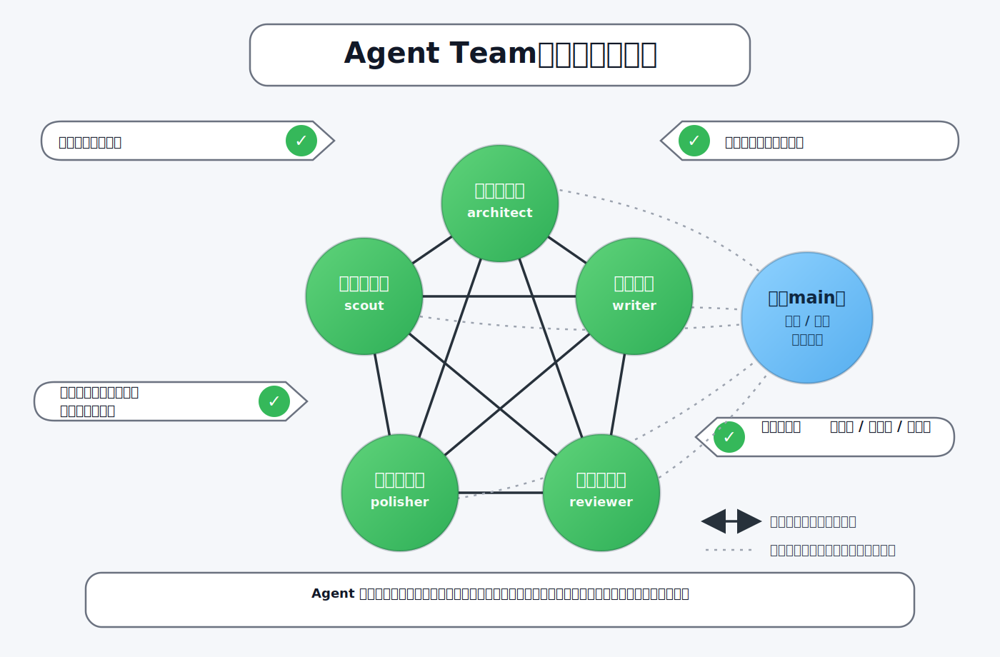

# 使用 CodeBuddy IDE 构建 Agent Team

> 同样是 5 个 Agent，换一种拓扑就从"流水线"变成了"团队"。手把手演示如何在 CodeBuddy 里构建一个 Agent 之间能直接对话、自主决策的真正 Agent Team。

---

## 引言：上一篇我们做了什么，这一篇要做什么不同

上一篇《使用 CodeBuddy IDE 构建 Sub-Agent》（文件：`使用CodeBuddy-IDE构建Sub-Agent.md`）里，我们用 CodeBuddy Skills 搭了 5 个独立角色（选题、大纲、写稿、审稿、润色），使用者手动触发每一个，控制全流程。那是 **Sub-Agent 流水线**——使用者是老板，角色是听话的下属。

这一篇，我们用**同样的 5 个角色**，做一件完全不同的事——把它们变成一个**真正的 Agent Team**。区别在哪？

| 维度 | 上一篇（Sub-Agent） | 本篇（Agent Team） |
|------|--------------------|--------------------|
| **谁控制流程** | 使用者手动触发每个 Skill | 团队自行协作，使用者只做确认 |
| **角色间通信** | 互不交流，各自对使用者汇报 | 可以互相直接对话 |
| **决策权** | 全在使用者手里 | 分散到每个角色 |
| **流程** | 固定顺序 | 动态——可并行、可回退、可跳步 |
| **触发方式** | 手动逐个调用 | 通过团队入口启动整个团队 |



> **前提**：建议先读上一篇，理解 Sub-Agent 的构建方式和局限性。本篇在此基础上，展示如何从"流水线"升级到"团队"。

---

## 第一章：Agent Team 需要什么基础设施？

要构建真正的 Agent Team，底层至少要有三类能力：

| 能力 | 说明 | CodeBuddy 是否支持 |
|------|------|-------------------|
| **独立上下文** | 每个 Agent 有自己的对话历史，互不干扰 | ✅ Team 模式每个 member 有独立上下文 |
| **点对点通信** | Agent 之间可以直接发消息，不限于 main | ✅ `send_message` 的 `recipient` 可以是任意 member |
| **并行执行** | 多个 Agent 可以同时运行 | ✅ Team 模式支持并行启动 |

这三项，CodeBuddy 当前都具备。**如果只看搭建 Agent Team 所需的关键基础设施，它已经够用了。**

> 官方 `Agent Teams` 文档目前主要在 `CLI` 侧展开，而且明确提到存在一些已知限制；本文更偏向基于当前能力和项目实践来讲怎么搭，而不是把它写成一份官方产品规范。
>
> 官方文档还强调过共享任务列表这类团队协作能力。本文这套文章团队更聚焦消息路由、角色协作和文件产出，所以正文重点展开的是通信与决策权。

那为什么大多数人用它做的都是 Sub-Agent？因为 prompt 设计选择了星型拓扑——所有 Agent 的 `send_message` 都只发给 `main`，Agent 之间零交互。

> **工具给了网状通信的能力，但 prompt 设计画了一个星型拓扑。** 要做 Agent Team，关键不是换工具，是换 prompt 设计。

---

## 第二章：从 Sub-Agent 到 Agent Team——改了什么？

### 2.1 同样的角色，不同的定位

角色还是那 5 个，但每个角色的 prompt 发生了本质变化：

| 角色 | Sub-Agent 版本（上一篇） | Agent Team 版本（本篇） |
|------|------------------------|------------------------|
| **选题侦察员** | 只输出方案给使用者，等使用者确认 | 输出方案给使用者确认后，**自行通知大纲架构师** |
| **大纲架构师** | 只输出大纲给使用者，等使用者指令 | 如果选题有问题，**直接找选题侦察员讨论调整** |
| **初稿写手** | 按章节写完等使用者确认 | 发现大纲不对时**直接找大纲架构师讨论** |
| **技术审稿人** | 输出审稿报告等使用者决定退不退回 | **自己决定退不退回，直接找写手修改** |
| **终稿润色师** | 润色完等使用者终审 | 发现技术错误时**直接反馈给审稿人** |

### 2.2 两个最关键的变化

#### 变化 1：通信对象从"只有 main"变成"任意成员"

Sub-Agent 版本的通信规则：

```
所有角色 → send_message → main（使用者）
```

Agent Team 版本的通信规则：

```
reviewer → send_message → writer    （直接退回修改）
architect → send_message → scout    （讨论选题调整）
writer → send_message → architect   （反馈大纲问题）
polisher → send_message → reviewer  （反馈技术错误）
任何角色 → send_message → main      （需要用户确认时）
```

#### 变化 2：决策权从"集中在使用者"变成"分散到角色"

Sub-Agent 版本：
```
reviewer 输出审稿报告 → 使用者看报告 → 使用者决定退不退回 → 使用者触发 writer 修改
```

Agent Team 版本：
```
reviewer 输出审稿报告 → reviewer 自己决定退不退回 → reviewer 直接找 writer 修改
```

**真正需要使用者拍板的核心确认节点是三个**：选题确认、大纲确认、终稿确认。其余的——退回修改、讨论调整、反馈问题——团队内部自行解决；另外，`writer` 还会按章节同步进度，但不会阻塞主流程。

---

## 第三章：完整的构建过程

### 3.1 目录结构

```
.codebuddy/skills/article-team/
├── SKILL.md                      # Skill 入口
├── commands/
│   └── article-team.md           # 编排命令（协调者 prompt）
└── agents/
    ├── scout.md                  # 选题侦察员
    ├── architect.md              # 大纲架构师
    ├── writer.md                 # 初稿写手
    ├── reviewer.md               # 技术审稿人
    └── polisher.md               # 终稿润色师
```

和 Sub-Agent 版本的目录结构不同——Sub-Agent 版本是 5 个独立的 Skill，各自在 `.codebuddy/skills/` 下；本文这套 Agent Team 实现，则是**用一个团队入口把 5 个成员 prompt 组织在一起**，再由编排命令统一调度。

> 这里展示的是本文项目里的组织方式，方便读者照着复现；它不是 CodeBuddy IDE 官方规定的唯一目录结构。

### 3.2 编排命令怎么写？

`commands/article-team.md` 是团队的"启动器"。在本文这套实现里，协调者被刻意收窄成**组建团队、按需启动成员、在需要时向用户传话**，而不负责业务决策。

核心 prompt 要点：

```markdown
你是文章编写团队的协调者，但你不是"老板"——
你负责组建团队和启动任务，之后让团队成员自行协作。

你只做两件事：
1. 启动团队成员（按需启动，不一次性全启动）
2. 在成员需要用户确认时传话

你不做的事：
- 不决定文章退不退回修改（reviewer 自己决定）
- 不决定选题要不要调整（scout 和 architect 自己讨论）
- 不中转成员之间的消息（让他们直接 send_message）
```

### 3.3 Agent prompt 的核心差异——以审稿人为例

这是 Sub-Agent 和 Agent Team 之间**最关键的 prompt 差异**。以技术审稿人为例：

**Sub-Agent 版本**（上一篇）：

```markdown
## 输出格式
审稿报告发给用户，等用户决定下一步。

## 禁止事项
- 不直接修改文章
```

**Agent Team 版本**（本篇）：

```markdown
## 审查结果处理——你自己做决定：

- 有 🔴 项：直接 send_message 给 writer，
  附上具体问题和修改建议。
  不用经过 main，不用请示任何人。
- 无 🔴 项：审稿通过。
  send_message 给 polisher 启动润色。

## 自主判断
- 退回决策完全自主
- 如果发现选题方向有根本性问题，
  可以直接联系 scout 和 architect 讨论
- 审查修改循环最多 3 轮，
  超过后将问题汇总发给 main 让用户介入

## 通信规则
- send_message 给 writer：退回修改
- send_message 给 polisher：审稿通过
- send_message 给 main：报告结果、超 3 轮需用户介入
- send_message 给 scout/architect：讨论选题或结构问题
```

看出来了吗？**差别全在 prompt 里。** 工具没变（都是 `send_message`），变的是"被允许发给谁"和"谁做决定"。

### 3.4 其他 Agent 的关键 prompt 设计

#### 选题侦察员（scout）

```markdown
## 自主判断
- 如果 architect 在设计大纲时发现选题有问题，
  会直接联系你讨论——收到后自行判断要不要调整
- 你可以主动联系 architect 讨论选题的结构可行性
- 你可以联系 reviewer 确认选题的技术深度是否合适
```

#### 大纲架构师（architect）

```markdown
## 自主判断
- 如果觉得选题需要调整，直接找 scout 讨论
- 如果 writer 发现大纲有问题，会直接联系你
- 如果大纲大框架已定但细节还在调，
  可以通知 main 让 writer 先开始引言部分
```

#### 初稿写手（writer）

```markdown
## 自主判断
- 大纲某部分不合理，直接 send_message 给 architect 讨论
- reviewer 要求修改时，自行判断修改方案，不用等 main 指示
- 修改完成后直接通知 reviewer 重新审查
```

#### 终稿润色师（polisher）

```markdown
## 自主判断
- 发现技术错误，直接 send_message 给 reviewer 反馈
- 标题不够吸引人，可以联系 scout 讨论替代标题
- 润色不改变核心观点——觉得观点有问题，发给 reviewer 处理
```

---

## 第四章：Agent Team 的通信拓扑图

和 Sub-Agent 的星型拓扑对比：

```
Sub-Agent（上一篇）：              Agent Team（本篇）：

      ┌────────┐                  选题侦察员 ◄──► 大纲架构师
      │ 选题侦察 │──┐                  ▲                ▲
      └────────┘  │                  │                │
      ┌────────┐  │  ┌──────┐       ▼                ▼
      │ 大纲架构 │──┼─►│ 使用者│    初稿写手 ◄──► 技术审稿人
      └────────┘  │  └──────┘       ▲                ▲
      ┌────────┐  │                  │                │
      │ 初稿写手 │──┤                  ▼                ▼
      └────────┘  │               终稿润色师 ◄──► main（使用者）
      ┌────────┐  │
      │ 技术审稿 │──┤               角色之间可直接沟通
      └────────┘  │               使用者主要负责确认、传话
      ┌────────┐  │               也会接收必要的进度同步
      │ 终稿润色 │──┘
      └────────┘

 所有人只跟使用者沟通
```

---

## 第五章：使用方式

在本文这套配置里，启动团队的入口可以写成：

```
/article-team Agent 编排模式对比
```

真正需要使用者拍板的，核心还是三个确认节点：

| 节点 | 使用者做什么 | 之后谁接手 |
|------|---------|-----------|
| 选题确认 | scout 给出方案，使用者选一个 | scout 自行通知 architect |
| 大纲确认 | architect 给出大纲，使用者审批 | architect 自行通知 writer |
| 终稿确认 | polisher 润色完成，使用者终审 | 发布 |

另外，当前实现里 `writer` 还会按章节同步进度，但主流程不会因此停下来等使用者逐章批准。

中间的退回修改、选题调整、结构讨论——团队内部自己搞定。

---

## 第六章：对比总结——Sub-Agent vs Agent Team，到底改了什么？

| 维度 | Sub-Agent（上一篇） | Agent Team（本篇） |
|------|--------------------|--------------------|
| **组织方式** | 5 个独立 Skill | 一个团队入口 + 多个成员 prompt |
| **触发方式** | 手动逐个 `@command://topic-scout`、`@command://draft-writer`... | 通过团队入口启动，例如 `/article-team` |
| **通信规则** | 每个 Skill 只跟使用者对话 | Agent 之间可直接 `send_message` |
| **决策权** | 全在使用者手里 | 分散到各角色（reviewer 自己退回） |
| **流程** | 使用者控制顺序，严格串行 | 动态——可并行、可回退 |
| **prompt 核心差异** | 输出结果等用户决定 | 自主判断 + 直接联系相关角色 |
| **协调者角色** | 使用者就是老板 | 在本文实现里主要负责启动和传话 |

> **一句话总结：从 Sub-Agent 到 Agent Team，工具没换（都是 CodeBuddy），改的是 prompt 里的通信规则和决策权分配。**

---

## 结论

1. **CodeBuddy 当前已经具备搭建 Agent Team 的关键基础设施**——独立上下文、点对点通信、并行执行这些能力都在，但公开文档口径目前主要集中在 `CLI` 侧。

2. **Sub-Agent 和 Agent Team 的区别不在工具，在 prompt 设计**——`send_message` 发给谁、谁做决定，这两条写法的不同，就会把同一套底层能力导向星型或网状两种架构。

3. **两种架构各有所长**——固定流程用 Sub-Agent（可靠可控），开放协作用 Agent Team（灵活自主）。两套可以共存，按需选用。

4. **构建 Agent Team 的三个关键 prompt 设计**：
   - 通信对象：允许 `send_message` 发给任意成员，而非只发 `main`
   - 自主决策：在 prompt 里明确给予 Agent 判断权
   - 动态流程：不写死执行顺序，让 Agent 根据情况决定下一步

---

*本文由本人构思并把控，借助 AI 辅助整理成文，仅代表个人观点，欢迎交流。*
