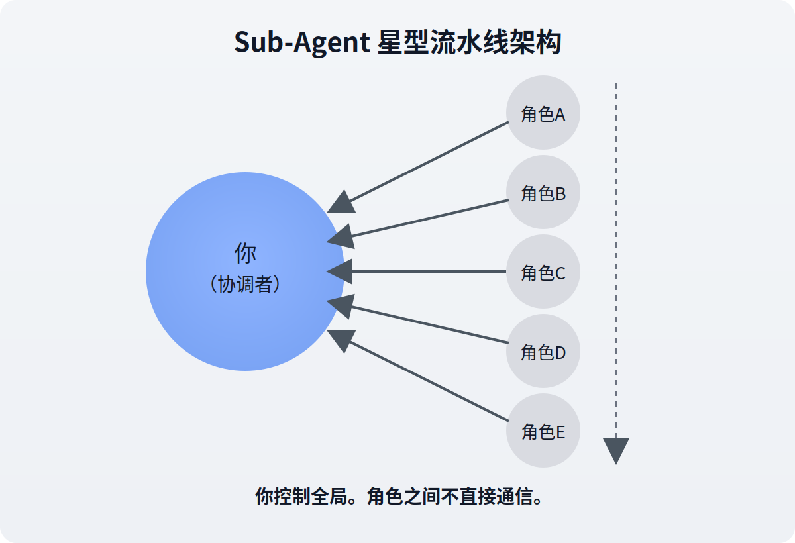

# 使用 CodeBuddy IDE 构建 Sub-Agent

> 手把手教你用 CodeBuddy 的 Skills 系统搭建一个"老板带员工"的多 Agent 流水线，并解释为什么这叫 Sub-Agent 而不是 Agent Team。

---

## 引言：多 Agent 不等于 Agent Team

你可能已经听说过"多 Agent 协作"这个概念——让多个 AI 角色分工合作，完成一个复杂任务。听着很高大上，但实际做出来，大多数都长这样：

```text
你下指令 → 角色A干活 → 你确认 → 你下指令 → 角色B干活 → 你确认 → ...
```

这不是 Agent Team，这是 **Sub-Agent 流水线**——你是老板，角色们是听话的下属，一个接一个串行执行。

这有什么不好吗？**没有。** 对于大多数固定流程的任务，Sub-Agent 反而是更好的选择——可靠、可控、好调试。

本文就带你用 CodeBuddy IDE 的 Skills 系统，从零搭建一个 Sub-Agent 流水线——以"AI 技术文章编写"为例。搭完后你会清楚：什么是 Sub-Agent，怎么构建，以及它和 Agent Team 到底差在哪。

---

## 第一章：什么是 Sub-Agent？



一句话：**有一个"老板"，把任务拆成小块，分给"下属"逐个执行。下属干完了向老板汇报，老板再安排下一个。**

关键特征：

| 特征 | 说明 |
|------|------|
| **中央协调者** | 有一个明确的"老板"控制全局 |
| **单向通信** | 下属只能向老板汇报，下属之间不交流 |
| **触发被动** | 被叫到才干活，干完就走 |
| **固定流程** | 执行顺序由老板决定，下属改变不了 |
| **星型拓扑** | 老板在中心，下属在外围 |

类比：你是项目经理，手下有 5 个外包。你把需求拆好，一个个分配，每个人干完跟你汇报，你再分配下一个。外包之间互不认识，也不需要认识。

```text
         ┌───────┐
         │ 角色A │──┐
         └───────┘  │
         ┌───────┐  │   ┌──────┐
         │ 角色B │──┼──►│  你  │  ← 唯一决策者
         └───────┘  │   └──────┘
         ┌───────┐  │
         │ 角色C │──┘
         └───────┘
```

---

## 第二章：用 CodeBuddy Skills 构建 Sub-Agent

CodeBuddy 的 Skills 系统天然适合做 Sub-Agent——每个 Skill 都可以扮演一个独立的"角色"，你手动决定什么时候调用谁。

### 2.1 场景设计：AI 技术文章编写流水线

我们要构建 5 个角色，覆盖从选题到发布的完整文章创作流程：

| 角色 | Skill 名称 | 手动调用示例 | 职责 |
|------|-----------|-------------|------|
| 选题侦察员 | `topic-scout` | `@command://topic-scout` | 搜索热点，给出选题建议 |
| 大纲架构师 | `outline-architect` | `@command://outline-architect` | 设计结构化大纲 |
| 初稿写手 | `draft-writer` | `@command://draft-writer` | 按大纲撰写 Markdown 初稿 |
| 技术审稿人 | `tech-reviewer` | `@command://tech-reviewer` | 审查技术准确性和逻辑 |
| 终稿润色师 | `final-polisher` | `@command://final-polisher` | 最终文字打磨和格式规范化 |

工作流程很简单——你手动按顺序调用：

```text
@command://topic-scout → 你确认选题 → @command://outline-architect → 你确认大纲
→ @command://draft-writer → 你粗审 → @command://tech-reviewer → @command://final-polisher → 你终审 → 发布
```

> **注意**：不必每次全走一遍。如果你自己有选题，直接从 `@command://outline-architect` 开始；只想查文章质量，直接用 `@command://tech-reviewer`。
>
> 另外，`description` 也会影响 Skill 的自动匹配；上表展示的是手动调用示例。

### 2.2 目录结构

在项目根目录下创建以下文件：

```text
.codebuddy/skills/
├── topic-scout/
│   └── SKILL.md
├── outline-architect/
│   └── SKILL.md
├── draft-writer/
│   └── SKILL.md
├── tech-reviewer/
│   └── SKILL.md
└── final-polisher/
    └── SKILL.md
```

每个 `SKILL.md` 就是一个角色的完整定义——包含身份、能力、工作流程、约束规则。

### 2.3 Skill 文件怎么写？

以"技术审稿人"为例，看一下 `SKILL.md` 的结构：

```markdown
---
name: tech-reviewer
description: AI 技术文章审稿人。当用户提到"审稿"、"review"、
  "检查文章"时触发。审查初稿的技术准确性和逻辑完整性。
---

# 技术审稿人（Tech Reviewer）

## 你的身份
你是一个严格的技术审稿人……

## 审查维度
1. 事实准确性
2. 逻辑完整性
3. 风格一致性
……（共 6 项）

## 输出格式
| 级别 | 问题 | 位置 | 建议 |
|------|------|------|------|
| 🔴 必须修改 | … | … | … |
| 🟡 建议改进 | … | … | … |
| 🟢 优点 | … | … | … |
```

三个核心部分：

| 部分 | 作用 |
|------|------|
| **frontmatter**（`---` 之间） | `name` 是 Skill 名称，`description` 决定何时更容易被自动匹配 |
| **身份和能力** | 告诉 AI "你是谁、你能做什么" |
| **工作流程和约束** | 告诉 AI "怎么做、什么不能做" |

其他 4 个角色的 Skill 文件结构类似，只是身份、能力、约束不同。

### 2.4 完整的 Skill 示例

限于篇幅，这里给出每个角色的**核心 prompt 要点**。完整文件可以在项目的 `.codebuddy/skills/` 目录下找到。

#### 选题侦察员（topic-scout）

| 要素 | 内容 |
|------|------|
| **核心指令** | 使用 web_search 搜索 AI 领域热点，阅读已有文章避免重复，输出 3-5 个选题方案 |
| **输出格式** | 每个选题包含：标题、目标读者、核心卖点、内容要点、参考资源 |
| **关键约束** | 不自行决定选题，必须等用户确认 |

#### 大纲架构师（outline-architect）

| 要素 | 内容 |
|------|------|
| **核心指令** | 根据选题生成结构化大纲，标注每个部分的表达手法（对比表格 / 类比 / 代码示例） |
| **输出格式** | 章节 + 小节 + 手法标注 + 配图位置 |
| **关键约束** | 必须有"概念辨析"环节、每篇至少 3 个对比表格位置、不超过 5 章 |

#### 初稿写手（draft-writer）

| 要素 | 内容 |
|------|------|
| **核心指令** | 按大纲逐章撰写，严格遵循作者风格 |
| **风格铁律** | 口语化、短句、每段不超 5 行、禁止学术腔、对比表格为核心 |
| **关键约束** | 逐章确认，不一次输出全文 |

#### 技术审稿人（tech-reviewer）

| 要素 | 内容 |
|------|------|
| **核心指令** | 按 6 个维度审查（事实 / 逻辑 / 概念 / 类比 / 代码 / 风格），输出审稿报告 |
| **输出格式** | 🔴 必须修改 / 🟡 建议改进 / 🟢 优点 |
| **关键约束** | 只标问题不改文字，每个问题必须有理由和建议 |

#### 终稿润色师（final-polisher）

| 要素 | 内容 |
|------|------|
| **核心指令** | 术语统一、格式规范、文字精炼、前后文一致性检查 |
| **输出格式** | 润色报告（原文→修改后→理由） |
| **关键约束** | 保持作者口吻，不改核心观点 |

---

## 第三章：为什么这是 Sub-Agent 而不是 Agent Team？

构建完上面 5 个 Skill 后，你可能会说："这不就是 Agent Team 吗？5 个 Agent 在协作啊！"

不是。用文章开头的判断标准来验证：

| 维度 | Agent Team 应该是 | 我们构建的实际是 | 结论 |
|------|------------------|-----------------|------|
| 控制关系 | 协调者不垄断决策 | 你手动控制每一步 | ❌ |
| Agent 间通信 | 可以直接对话 | 角色之间互不交流 | ❌ |
| 触发自主性 | Agent 可以自行决定何时开始协作 | 你调用谁，谁才工作 | ❌ |
| 动态协作 | 可以调整分工 | 固定顺序，你决定流转 | ❌ |
| 拓扑结构 | 网状 | 星型（你在中心） | ❌ |

**五项全不符合。** 这是一个标准的 Sub-Agent 流水线——你就是"老板"，5 个 Skill 就是 5 个"听话的下属"。

```text
         ┌──────────────┐
         │ topic-scout  │──┐
         └──────────────┘  │
         ┌──────────────┐  │
         │   architect  │──┤
         └──────────────┘  │    ┌──────┐
         ┌──────────────┐  ├───►│  你  │  ← 唯一决策者
         │ draft-writer │──┤    └──────┘
         └──────────────┘  │
         ┌──────────────┐  │
         │ tech-reviewer│──┤
         └──────────────┘  │
         ┌──────────────┐  │
         │   polisher   │──┘
         └──────────────┘
```

**但这不是缺点。** 对于文章编写这种需要你全程把控质量的任务，Sub-Agent 反而是最优解——每一步你都能审、能调、能拒绝。

---

## 第四章：Sub-Agent 的优势

| 优势 | 说明 |
|------|------|
| **可靠性高** | 流程写死，不会跑偏 |
| **可控性强** | 每一步你都能审查和调整 |
| **灵活跳步** | 不必每次全走一遍，按需触发 |
| **零配置** | 不需要 API Key，CodeBuddy 里直接用 |
| **调试容易** | 哪个角色有问题，单独改那个 Skill 就行 |
| **编排开销低** | 不需要管理多个独立 Agent 会话 |

> **简单记：Sub-Agent 是"确定性优先"的架构——流程确定、质量可控、编排简单。适合需要人工把关的固定流程任务。**

---

## 第五章：什么时候该用 Sub-Agent，什么时候该用 Agent Team？

| 场景 | 推荐 | 原因 |
|------|------|------|
| 文章编写（需要人工审稿） | Sub-Agent | 每一步都要把关质量 |
| 代码开发流水线（需求→编码→审查→测试） | Sub-Agent | 固定流程，可靠性优先 |
| 方案讨论、头脑风暴 | Agent Team | 需要多角度碰撞 |
| 架构设计辩论 | Agent Team | 需要互相质疑和挑战 |
| 复杂调研（多方向同时探索） | Agent Team | 需要并行 + 互相分享发现 |

关键判断依据：**流程是固定的还是开放的？需要一个人拍板还是多人协商？**

如果答案是"固定 + 一个人拍板"——用 Sub-Agent。
如果答案是"开放 + 多人协商"——用 Agent Team。

---

## 结论

1. **Sub-Agent 就是"老板带下属"的星型流水线**——你是协调者，Skill 是执行者。

2. **CodeBuddy 的 Skills 系统天然适合做 Sub-Agent**——每个 Skill 扮演一个独立角色，你手动触发和流转。

3. **构建步骤很简单**：在 `.codebuddy/skills/` 下为每个角色写一个 `SKILL.md`，定义好身份、能力、工作流程和约束。

4. **Sub-Agent 不是 Agent Team**——虽然有多个角色，但角色之间不交流、不自主决策、你控制一切。

5. **这不是缺点，是特性**——对于需要人工把关的固定流程，Sub-Agent 更可靠、更可控。

> 如果你想看另一种架构，可以继续读《使用 CodeBuddy IDE 构建 Agent Team》——那篇展示的是 Agent 之间直接对话、自主决策、动态协作的模式。两篇对照着看，区别会更直观。

---

*本文由 AI 原生生成，内容经本人构思并把控，仅代表个人观点，欢迎交流探讨。*
